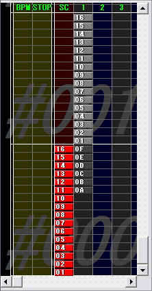
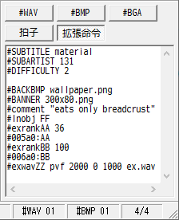
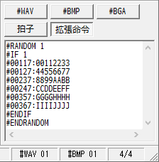
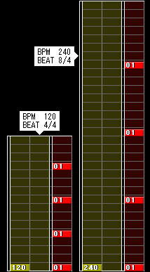
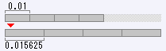
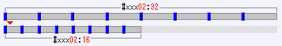
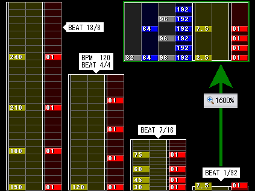

# BMSE 兼容性参考

> 来源：[BMSE Help — 拍子・拡張命令タブ](https://hitkey.nekokan.dyndns.info/bmse_help_full/beat.html)
> 涉及 BMSE 打开和保存 BMS 文件时对命令的处理行为。

## 一、BMSE 打开时会改写的命令

下列命令在 BMSE 中打开时会被篡改或删除：

| 命令 | 问题 |
|------|------|
| `#PLAYER 4` | Battle Play → 变为 PMS（9 Keys） |
| `#PLAYLEVEL string` | 字符串值难度 → 变为值 `0` |
| `#RANK 4` | VERY EASY 判定 → 变为 EASY（值 `3`） |
| `#WAV00` | 地雷爆炸音定义 → **被删除** |
| `#WAVCMD` | → 变为 `#WAVMD` |
| `%URL` | → **被删除** |
| `%EMAIL` | → **被删除** |
| `#RANDOM` 嵌套 | 嵌套范围识别错误 |
| `#RANDOM` 区间内写有 BMSE 原生支持的命令 | 这些命令被“卷起”到分叉外 |
| 扩展命令选项卡装不下的分叉或通道数据 | → **被丢弃** |

## 二、BMSE 原生支持的命令



以下命令 BMSE 原生支持（出现在主面板或定义列表中）。即使写在 `#IF`-`#ENDIF` 分叉中，BMSE 读取时也会将其**卷起到分叉外**。

- `#PLAYER`
- `#GENRE`
- `#TITLE`
- `#ARTIST`
- `#BPM`
- `#PLAYLEVEL`
- `#RANK`（值 `4`（VERY EASY）会被矫正为 `3`（EASY），可通过 `#DEFEXRANK` 指定同等判定宽度）
- `#TOTAL`
- `#VOLWAV`
- `#STAGEFILE`
- `#WAVzz`（`<Materials>` 记法不会报错但不生效）
- `#BMPzz`（同上）
- `#BGAzz`
- `#BPMzz`（定义编号被自动重排为 `01` 开始的连续编号）
- `#STOPzz`（定义编号被自动重排为 `01` 开始的连续编号）

> **注意**：如果 `#BPMzz` / `#STOPzz` 的**定义**和**配置通道**都写在分叉内，BMSE 读取后：定义被卷起到分叉外，配置通道留在分叉内。卷起后的定义因无配置引用而被视为无意义删除。

## 三、BMSE 不支持的扩展命令

扩展命令选项卡是用于记录 BMSE 不直接支持的命令的文本框。
关于文本输入操作参见
[BMSE Help — テキスト入力フォームの操作](https://hitkey.nekokan.dyndns.info/bmse_help_full/direct.html#textbox)，
扩展命令的详细说明参见
[BMS command memo](https://hitkey.nekokan.dyndns.info/cmdsJP.htm#TOC)
等文档。

BMSE 不支持的命令几乎全部被隔离到此选项卡。但有例外：自由区域和地雷的配置通道文在 BMSE 打开时会被**删除**。因此仅通过 BMSE 打开谱面无法判断是否存在 BMSE 不支持的命令——这一点请注意。

以下命令 BMSE 不原生支持，打开后会被隔离到“扩展命令”选项卡。**但并非所有都能安全保留——部分会被直接删除**。

### 可保留到扩展命令选项卡的

| 命令 | 补充说明 |
|------|----------|
| `#DEFEXRANK` | |
| `#EXRANKzz` | 对应通道 `#xxxA0` 保留 |
| `#BANNER` | |
| `#BACKBMP` | |
| `#CHARFILE` | |
| `#PREVIEW` / `#PREVIEWPOINT` / `#PREVIEWTIME` | |
| `#OFFSET` | |
| `#DIFFICULTY` | |
| `#SUBTITLE` | |
| `#SUBARTIST` | |
| `#MAKER` | |
| `#COMMENT` | |
| `#EXT` | |
| `#TEXTzz` / `#SONGzz` | 通道 `#xxx99` 被删除，但 `#TEXTxx` 定义可保留 |
| `#PATH_WAV` | 只是字符串，无害 |
| `#EXBPMzz` | |
| `#BASEBPM` | |
| `#STP` | |
| `#LNTYPE` 1/2 | |
| `#LNOBJ ZZ` | |
| `#LNMODE` | |
| `#SCROLLzz` | 通道 `#xxxSC` 保留 |
| `#SPEEDzz` | 通道 `#xxxSP` 保留 |
| `#4K` / `#6K` | |
| `#OCT/FP` | |
| `#OPTION` | |
| `#CHANGEOPTIONzz` | 通道 `#xxxA6` 保留 |
| `#EXWAVzz` | |
| `#CDDA` | |
| `#MIDIFILE` | |
| `#EXBMPzz` | |
| `#@BGAzz` | |
| `#POORBGA` | |
| `#SWBGAzz` | 通道 `#xxxA5` 保留 |
| `#ARGBzz` | |
| `#VIDEOFILE` / `#VIDEOF/S` / `#VIDEOCOLORS` / `#VIDEODLY` | |
| `#MOVIE` | |
| `#SEEKzz` | 通道 `#xxx05` 被删除 |
| `#EXTCHR` | 通道 `#xxx05` 被删除 |
| `#MATERIALSWAV` / `#MATERIALSBMP` | |
| `#DIVIDEPROP` | |
| `#CHARSET` | |

### 会被 BMSE 直接删除的

| 命令或通道 | 原因 |
|-----------|------|
| `#WAV00` | 被当作 `#WAV` 处理，00 被视为非法编号被删 |
| `#WAVCMD` | 变为 `#WAVMD`（多个 `#WAVCMD` 时，仅最后一个幸存为 `#WAVMD`） |
| 地雷通道 `#xxxD1-E9` | **从 BMS 文件中删除** |
| 自由区域通道 `#xxx17` / `#xxx27` | 从通道列表中删除 |
| 通道 `#xxx[1-6](0\|7)` / `#xxx[7-9][0-9]` | 读取时删除（含 `xxx17` 等自由区域通道） |
| 通道 `#xxx[D-E][0-9]` | **删除**（含地雷通道） |
| `%URL` / `%EMAIL` | 不以 `#` 开头，被忽略删除 |
| **信息选项卡**（创作者注释等） | BMSE 对象面板 → 信息选项卡内容被删除 |

> 如果不想让 `%URL` / `%EMAIL` / 信息选项卡内容被删除，可以在行首添加 `#`，将其伪装为 BMSE 扩展命令选项卡可保留的格式。但无法保证其他应用程序能正常播放。
> **时效性说明**：以下信息基于截至 2024 年的资料。2024 年后新型播放器仍在不断实现新扩展命令，BMSE Help 作者可能未能全部掌握。

### BMSE 读取时保留到扩展命令选项卡的

以下通道 BMSE 无法原生解析，但**不会删除**——读取后自动收入扩展命令选项卡：

| 通道范围 | 行为 |
|---------|------|
| `#xxx[0-6][A-Z]` | 保留到扩展选项卡 |
| `#xxx[7-9][A-Z]` | 保留到扩展选项卡 |
| `#xxx[A-C][0-9A-Z]` | 保留到扩展选项卡 |
| `#xxx[D-E][A-Z]` | 保留到扩展选项卡 |
| `#xxx[F-Z][0-9A-Z]` | 保留到扩展选项卡 |



> **注意**：若将上述会被删除的通道写在 `#IF`-`#ENDIF` 分叉中（用 **ダミー分岐** 技巧保护），则 BMSE 不会删除它们。

## 四、制御構文（Control Constructs）与 BMSE 的分支识别

BMSE 对标准 BMS 控制构文的支持有限：

| 命令 | BMSE 识别 |
|------|-----------|
| `#RANDOM` | 识别 |
| `#SETRANDOM` | 不识别 |
| `#IF` | 识别 |
| `#ELSEIF` | 不识别 |
| `#ELSE` | 不识别 |
| `#ENDIF` | 识别 |
| `#ENDRANDOM` | 不识别 |
| `#SWITCH` | 不识别 |
| `#SETSWITCH` | 不识别 |
| `#CASE` | 不识别 |
| `#SKIP` | 不识别 |
| `#DEF` | 不识别 |
| `#ENDSW` | 不识别 |

### BMSE 的分支识别逻辑

- 识别 **`#IF` 到最近的 `#ENDIF` 的区间**，区间内的未知命令和所有通道行收纳入扩展命令选项卡。
- 如果有 `#RANDOM` 命令，还识别 **`#RANDOM` 到最近的 `#IF` 的区间**。

### 嵌套问题

BMSE **不支持分支嵌套**。例如以下代码：

```bms
#RANDOM 1
    #LEVEL 1
    #IF 1
        #00111:11
        #RANDOM 1
            #LEVEL 2
            #IF 1
                #00212:22
            #ENDIF
        #ENDRANDOM
        #00313:33
    #ENDIF
#ENDRANDOM
```

BMSE 将「第一个 `#RANDOM` 到第一个出现的 `#ENDIF`」识别为分支区间。因此：

- `#00313:33` 被视为分支范围外的普通文本，被推出扩展命令选项卡，在主面板渲染。
- `#RANDOM`-`#IF`-`#ENDIF` 以外的控制命令（如 `#SWITCH`）视为未知扩展命令，收纳入扩展命令选项卡。
- 使用单一 `#IF`-`#ENDIF` 区间且不嵌套时可正常工作。
- `#SWITCH` 区间内无 `#RANDOM` 嵌套时，可将整个 `#SWITCH` 区间用ダミー分岐保护。



## 五、ダミー分岐（Dummy Branch）技巧

BMS 格式规范中**标准存在**「播放时生成随机数、随机选择分支内容」的命令。最终谱面内容直到实际播放时才确定。虽然不存在直接支持分支命令的谱面编辑器，但 BMSE 能识别分支区间并分类收纳——这是 BMSC 和 GDAC2 所不具备的优秀特征。

BMSE 会将 `#IF n` 到 `#ENDIF` 之间的几乎所有未知命令和通道行隔离到扩展命令选项卡。利用这一机制，可以保护 BMSE 会删除的内容。

### 基本写法

```bms
#RANDOM 1
  #IF 1
    ; 在这里写入 BMSE 不支持的通道行或命令
    #001D1:001E
    #00117:00110000
    #SCROLL01 2
    #001SC:0100000000000000
  #ENDIF
#ENDRANDOM
```

- `#RANDOM 1` 生成值恒为 `1`（1 到 1 之间的随机数），所以 `#IF 1` 的内容在播放时始终应用。
- BMSE 将 `#RANDOM 1` ~ `#ENDIF` 之间的内容整体隔离到扩展命令选项卡，不进行解析，从而保护其中的通道行不被删除。
- `#ENDRANDOM` 不是 BMS 标准命令，但写上后在使用 nanasigroove 时更安全。

### 适用场景

- 保护地雷通道 `#xxxD1-E9` 不被 BMSE 删除
- 保护自由区域通道 `#xxx17` / `#xxx27`
- 保护 BMSE 无法处理的 576 分音符、1300 次以上的 STOP 序列等
- 保护 `#SCROLL` / `#SPEED` 等扩展命令

### 注意事项

- BMSE **原生支持的命令**（如 `#WAV`, `#BPM`, `#TITLE` 等）即使写在分叉中也会被卷起到分叉外——这个技巧对它们无效。
- BMSE **不支持分叉嵌套**。`#RANDOM`-`#IF`-`#ENDIF` 嵌套时，BMSE 将「第一个 `#RANDOM` 到第一个 `#ENDIF`」识别为分叉范围，范围外的通道行（如嵌套外部的 `#00313:33`）被当作文本推出扩展选项卡，在主面板渲染。
- 巨大的分叉可能超出扩展命令选项卡容量（见下文）。
- 操作主面板（添加/删除小节、调整定义列表顺序等）时，扩展命令选项卡中的内容**不会同步更新**，可能导致谱面与扩展命令不匹配。建议在所有编辑完成后再写入扩展命令。
- 不想写ダミー分岐时，可以使用支持自由区域的 BMSC 或直接用文本编辑器。
- ダミー分岐可以包含各种内容——例如将 BMSE 无法处理的 576 分音符或 1300 次以上 STOP 序列退避到ダミー分岐中，避免 BMSE 的语法解析器处理它们。
- 如果在扩展命令选项卡中发现空的分支，请用文本编辑器确认原始谱面的内容。
- 通道行写入ダミー分岐后可以**全部保护**。

## 六、扩展命令选项卡的容量限制

| 操作系统 / 条件 | 上限 | 超出时的行为 |
|-----------------|------|-------------|
| Windows 95 | 约 63356 字符（非 ASCII 字符多时出现乱码） | 强制退出 |
| Windows 98/ME，仅 ASCII 字符 | 63348 字符 | — |
| Windows 98/ME，非 ASCII 字符多 | 16383 字符 | 16384 字符起截断 |
| Windows 2000/XP+，仅 ASCII 字符 | 65535 字符 | 65536 字符起截断丢弃 |
| Windows 2000/XP+，非 ASCII 字符多 | 32767 字符 | 32768 字符起截断丢弃 |
| Windows 2000/XP+，非 ASCII 字符少量混入 | **9 字符**（!?） | Visual Basic 6.0 的固有限制 |

> **注意**：最后一项「9 字符限制」源于 Visual Basic 6.0 和 Windows 的底层行为，非 BMSE 自身问题。但在东亚语言环境中，BMS 代码中混入非 ASCII 字符是常见情况，因此扩展命令选项卡中编辑大量内容时应格外谨慎。

- 文件大小超过 64 KiB（65535 bytes）的谱面可能包含巨大的分叉，打开前建议先检查。

## 七、扩展命令选项卡注意事项

### 与主面板的功能隔离

BMSE 的**所有功能均不适用于扩展命令选项卡**的内容：

| BMSE 操作 | 对扩展命令选项卡的影响 |
|-----------|----------------------|
| 定义列表整列 | 选项卡内的配置行继续引用整列前的编号 |
| 未使用定义删除 | 仅在 `#IF`-`#ENDIF` 区间内被引用的定义视为未使用并被删除 |
| 未使用文件删除 | 仅在 `#BANNER` 定义中被引用的图像文件视为未使用并被删除 |
| 小节插入/删除 | 分支内容可能适用于非预期的小节 |
| 拍子变更 | 选项卡内“等分配置”的分割长度变更（节奏变化） |
| 组合执行 | 可能无法修复 |

**建议**：在所有其他编辑工作完成后，最后写入扩展命令选项卡的内容。

### 撤销限制

扩展命令选项卡文本框内的 Ctrl+Z/Ctrl+Y 是 **Windows 自身的撤销功能**，不是 BMSE 的撤销/重做。通常只能追溯 **1 步**。


### 保存位置

BMSE 保存时，扩展命令选项卡的记述插入到 BMS 代码中 **MAIN DATA FIELD 的紧前方**。


### 星号标记

打开含有扩展命令选项卡内容的谱面时，BMSE 标题栏末尾显示 `*`（星号）。

## 八、拍子选项卡的操作说明

BMSE 可以为每个小节指定拍子。默认值为 4/4 拍子，例如 9/4 拍子则该小节长度为 4 分音符 × 9 个。
指定拍子后主面板上对应小节的长度也会变化，可以直观地编辑变拍子谱面——
这是所有小节等长显示的 BMSC / GDAC2 所不具备的特征（iBMSC / μBMSC 是两种方式的混合）。

### 基本操作

- 在拍子选项卡中，**左键单击**小节列表或移动列表光标来选择目标小节
- 从下拉列表中选择拍子值后按下 **Enter**，将值应用到所有选中的小节
- 拍子分子可选 **1–64** 的正整数，分母可选 **4, 8, 16, 32, 64**
- 最小拍子为 **1/64**，最大为 **64/4**
- 支持 **Home / End / Page Up / Page Down / 方向键** 导航

### 小节长的定义

**【小节长 = 拍子分子 ÷ 拍子分母】**。以 4/4 拍子 1 小节长度为 1 时，3/4 拍子的小节长为 `0.75`，8/4 拍子的小节长为 `2`。

BMS 书式中，拍子以**小节长**表示（配置通道 `#xxx02`）：

- `#00002:0.75` → #000 小节为 3/4 拍子
- `#00102:2` → #001 小节为 8/4 拍子
- 小节长通道每个小节仅解释 1 文（不可重复）
- 小节长通道按每个小节独立应用（效果不延续）
- 小节长 `1` 时，该小节的小节长通道文可省略

### 快捷键

| 操作 | 效果 |
|------|------|
| **Ctrl + 左键** | 切换选择状态（追加/解除） |
| **Shift + 左键** | 范围选择（以 Shift 按下时的光标位置为起点） |
| **Shift + 方向键** | 键盘范围选择 |
| **Enter** / **双击** | 将列表值应用到当前选中的所有小节 |
| **Ctrl+Z / Ctrl+Y** | 撤销/重做拍子变更（但不可过度依赖） |

### 全选注意事项

按下 `Ctrl+A` 或双击小节列表可将 **#000–#999 全选**。但全选后统一变更拍子会导致以下播放器在到达 `#999` 之前不会切换到结果画面：

- nBMplay、BMEV、DDR、rhythm-it!、nazobmplay、charatbeatHDX
- BMIIDXView2015、Angolmois（DDR 只用到 `#998`）

> **建议**：不要使用全选功能统一变更拍子。仅选择必要的区间进行变更，且从「谱面作者预期的终止小节」之后的区间应全部恢复为 4/4 拍子。

### 对象重叠处理

当拍子变更导致小节长度变化时：

- **小节伸长**：在小节末尾插入空位
- **小节缩短**：溢出的对象向后推移；若推移位置已有对象，**更近编辑的对象**显示在前方；若双方均无编辑历史，后方小节的对象显示在前方
- 为避免重叠，应在变更拍子前先插入空的小节

## 九、BMSE 的小节长度限制

BMSE 通过“拍子”来管理小节长度。这使其擅长变拍子编辑，但对比值型小节长度（比率ソフラン）存在以下限制：

| 条件 | 行为 |
|------|------|
| 最小值 | 1/64 拍子（值 `0.015625`） |
| 最大值 | 64/4 拍子（值 `16`），超过 `16` 的值视为 `16` |
| 非 0.015625 倍数 | 取整到最近的 0.015625 倍数 |
| 值 `0` / 空 / 字符串 | 视为 4/4 拍子（值 `1`） |
| 负值 / < 0.015625 | 视为 0.015625 |
| 有效数字 | 15 位。例如 `0.03` 被解释为 `2.60416666666667E-02` |
| 溢出 | 绝对值超过 170.666... 时强制退出 |

> **注意**：上述限制意味着 BMSE 不适合处理依赖小数值比率进行滚动速度变化的谱面（比率ソフラン），这类谱面改用 `#SCROLL` 扩展更为合适，或在 BMSC/iBMSC/μBMSC 等编辑器中进行编辑。

### BMSE 对比值型小节长度的弱点

BMS 中可通过调整 BPM 与 小节长度 的**比值**来实现不改变音乐速度、只改变谱面滚动速度的效果。例如 BPM 120 的 4/4 小节与 BPM 240 的 8/4 小节经过时间相同——关键在于 **BPM 与 小节长度的比值**。

示例：将 BPM 设为 119，小节长度设为 0.991666...（保持 [120:1] → [119:0.991666...] 的比值）可在不改变音播放速度的前提下调整谱面滚动速度。

**BMSE 的弱点**：

1. 更改配置间隔不如 BMSC/GDAC2 方便
2. 小节长度 0.991666... 不能表示为拍子，BMSE 无法正确配置

   

3. **链式保存退化**：原始 BPM=119、小节长度=0.991666 的谱面，经 BMSE 保存后四舍五入为 64 分音符 × 63
   个分；原本 4 等分节奏被嵌入 63 等分 → 要求 189 个 192 分音符 → 189÷4 不可整除 → 产生可见误差

因此依赖小数值比率进行滚动速度变化的谱面（比率ソフラン）不适合用 BMSE 编辑，建议改用 BMSC/iBMSC/μBMSC 或文本编辑器。

### BMSE 的优势：小节内滚动速度变化（加法型变拍子）

需要指出的是，BMSE 在**加法型**小节长度操作上反而比其他编辑器更强。当需要在小节内通过 BPM 变化组合来改变谱面滚动速度时（例如 BPM 翻倍使配置间隔翻倍等），各编辑器的特点如下：

| 编辑器 | 优势 |
|--------|------|
| **BMSE**（及 beditor） | **加法型**——擅长小节长度的加减组合 |
| BMSC / GDAC2 | **比值型**——擅长小节长度的比率操作 |
| iBMSC / μBMSC | **混合型**——两者均可胜任 |
| 文本编辑器 | **全能型**——直接编辑 BMS 代码，不受编辑器约束 |

近年来，极端推进区间长度概念的ギミック（特效）谱面展现出空前的滚动表现力。纯文本编辑可突破 BMSE/iBMSC/μBMSC 的限制，制作出编辑器无法处理的谱面。

例如，通过极度细分的停止序列可实现“滚动停止中静止画面仍在动画”的演出——
原理是用“极小程序段 + 多次停止”伪装成一次停止事件。
为在 LR2 上伪冒 BPM 显示值，需要极大值的扩展 BPM 变更，并配合相应的大值停止序列。
这种手法可将小節线从视觉上抹除，应用于地雷动画、小節线动画、甚至结合音效替代 BGA 等场景。

> 参考：XYZ 氏「BMS制作について Advent Calendar 2016」中的「ギミック譜面の基礎 (1)」「ギミック譜面の基礎 (2)」等文章。

### 小节长度值汇总

BMSE 对所有小节长度值的处理方式：

| 条件 | BMSE 行为 |
|------|-----------|
| 值 `0`、空、字符串、省略 | 视为 4/4 拍子（小节长度 `1`） |
| 负值、< 0.015625 | 视为 `0.015625`（1/64 拍子） |
| > 16 | 视为 `16`（64/4 拍子） |
| 非 0.015625 的倍数 | 四舍五入到最近的 0.015625 倍数 |
| 有效数字 | 15 位（如 `0.03` 被解释为 `2.60416666666667E-02`） |
| 有效范围 | 绝对值超过 170.666... 时溢出 → **BMSE 强制退出** |

### 特殊拍子：拍子选项卡无法指定但 BMS 代码支持的拍子

拍子选项卡的下拉列表仅限 1/64–64/4 范围，但 BMS 代码本身可表示更灵活的拍子值：

| BMS 代码示例 | 实际拍子 | 说明 |
|-------------|---------|------|
| `#00002:1.015625` | **65/64** | 略大于 4/4 |
| `#00002:15.984375` | **1023/64** | 接近 64/4 但非标准值 |

- 拍子选项卡无法正确显示这些值，但编辑和保存不受影响
- 将这些拍子更改为其他值后再执行 **撤销（Ctrl+Z）**，特殊拍子会以正确值显示（但状态栏的拍子导航仍只显示后两位）
- 在**直接输入框**中手动输入也可设置特殊拍子，但显示异常且无法重做（Redo）
- **建议**：调整特殊拍子值时直接使用文本编辑器编辑 BMS 文件

> **额外注意**：拍子选项卡中 `#983`–`#999` 范围存在以下 BMSE 崩溃问题：
>
> 1. `#983`–`#999` 中的某小节设置为比 4/4 更长的拍子
> 2. 主面板当前位置在 `#501` 之后
> 3. `#983`–`#999` 中的某小节设置为比 4/4 更短的拍子
>
> 以上三个条件**同时满足**时 BMSE 会**强制退出**，且不会生成临时备份文件。
> 此问题可能与垂直滚动条的 16 小节末端留白有关，但确切原因不明。
> 使用这些非常规拍子值前建议先保存谱面。




- **例 1**：小节长 `0.01` 延续 200 小节的谱面 — BMSE 上 `0.01` 被四舍五入为 `0.015625`，误差 `0.005625` 累积 200 小节后，比原长度多出「8 分音符 × 9 个」的长度。

- **例 2**：小节长 `32` 以 8 等分间隔配置对象的谱面 — BMSE 上变为「长度 `16` 以 8 等分间隔」，比原长度短「4/4 拍子的 16 小节」。

小节长与曲长几乎同义。**用 BMSE 打开谱面时，务必确认曲子是否发生了变化**——仅通过 BMSE 打开很难察觉四舍五入的影响，可疑的谱面请用文本编辑器查看 BMS 代码。

> 编辑现有谱面前，建议先用 [bms diff tool](https://stairway.sakura.ne.jp/smalltools/minibmsplay/diff.htm) 对比原始文件和 BMSE 保存后的文件，确认是否存在四舍五入导致的偏差。

## #SCROLL / #SPEED 扩展

> 来源：[BMSE Help — 拍子・拡張命令タブ](https://hitkey.nekokan.dyndns.info/bmse_help_full/beat.html)
> 这些是 Bemuse 提出的 BMS 扩展命令，用于在不改变小节长度的情况下控制滚动速度。

### #SCROLL[01-ZZ] n

| 项目 | 内容 |
|------|------|
| 通道 | `#xxxSC` |
| 来源 | Bemuse |
| 支持 | beatoraja (0.6.4+), Bemuse, Qwilight (1.4.21+), raindrop (0.300+), μBMSC (3.4.0.3+) |

- 定义指定区间内的谱面滚动速度倍率。
- 与 `#xxx02`（小节长度）不同，`#SCROLL` 只改变滚动速度，不影响音频播放时机或对象排列间隔。
- 值 `2` 表示 BPM 翻倍的滚动速度；值 `0.991666` 表示 BPM 119 当量的滚动速度（原 BPM 为 120 时）。
- `#SCROLL` 值 `0` 可实现 STOP 效果：滚动完全停止，但停止期间声音和 BGA 可按任意时机正常播放——比 `#STOP` 更灵活。
- 与 BMSE 的兼容性：`#SCROLL` 是**少数能通过 BMSE 保存后保留的扩展命令**之一。通道号 `#xxxSC` 须用大写字母书写。
- BMSE 本身不原生支持 `#SCROLL`，但会将其隔离到扩展命令选项卡中，保存时写回 BMS 文件。

### 示例

```bms
#SCROLL01 2
#SCROLL02 0.5
#001SC:0100000000000000
#002SC:0000000000000002
```

此例中 `#001` 前半部分以 2 倍速滚动，`#002` 后半部分以 0.5 倍速滚动。



### 用途

- 在不改变 BPM 和小节长度的情况下，仅改变谱面可视滚动速度。
- 替代 `#STOP` 实现更可控的暂停效果——暂停期间仍可播放音效和 BGA。
- 与 `#BPM` 和小节长度的组合相比，`#SCROLL` 不需要调整对象排列位置。

> **背景**：BMSE 对小节长度（`#xxx02`）的处理存在精度限制——值须为 1/64 的倍数
> （`0.015625`），因此无法精确处理通过调节 BPM 与小节长度比值来实现的滚动速度变化
> （比率ソフラン）。`#SCROLL` 扩展正是为解决此问题而提出的，可在不改变 BPM 和小节
> 长度的前提下直接控制滚动速度，规避 BMSE 的精度缺陷。

---

> 译者注：以下 #SPEED 的详细说明非 BMSE Help 原始内容，部分基于其他来源补充。

### #SPEED[01-ZZ] n

| 项目 | 内容 |
|------|------|
| 通道 | `#xxxSP` |
| 来源 | Bemuse |
| 支持 | 同 `#SCROLL`（BMSE Help 未单独列出 #SPEED 兼容性，各实现程度参考 #SCROLL） |

- 在指定区间内以**关键帧插值**方式持续改变谱面滚动速度。
- `#SCROLL` 是分段恒定值，而 `#SPEED` 可在区间内线性过渡。
- 适合实现“自动伸缩的高速度选项”类效果。

### #SPEED 示例

假设要在 8 个小节内将滚动速度从 1.0 线性提升到 10.0：

```bms
#SPEED01 1
#SPEED02 10
#001SP:01
#008SP:02
```

无需逐小节计算 `#SCROLL` 值，`#SPEED` 会在两个关键帧之间自动补间。

### 负值：逆向滚动

- `#SCROLL` 的倍率设为负值时，谱面**逆向滚动**（逆走）。
- 正负交替可实现复杂的滚动演出。
- 支持负值逆走的实现包括 beatoraja、ruvit、fgt++、Angolmois、Sonorous 等。
- **注意：** 负值逆走功能非 BMSE Help 原始内容，而是 beatoraja 等播放器对 `#SCROLL` 扩展的实现行为。

```bms
#SCROLL01 -1
#001SC:0100000000000000
#002SC:FF
```

---

### 扩展兼容注意事项

- BMSE 打开包含 `#SCROLL` / `#SPEED` 的谱面时，这些命令会被隔离到“扩展命令”选项卡中。
- 保存后这些命令保留在 BMS 文件中，不会被 BMSE 丢弃。
- 这些命令由 Bemuse 提出，非 BMS 原始规范的一部分。在不支持这些扩展的实现中，相关通道会被忽略。
- 通道号 `#xxxSC` / `#xxxSP` 中的字母**必须大写**（小写 `#xxxsc` 不被 Bemuse 和 μBMSC 识别）。
