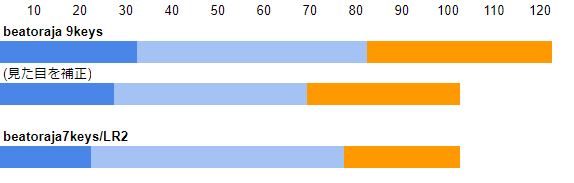
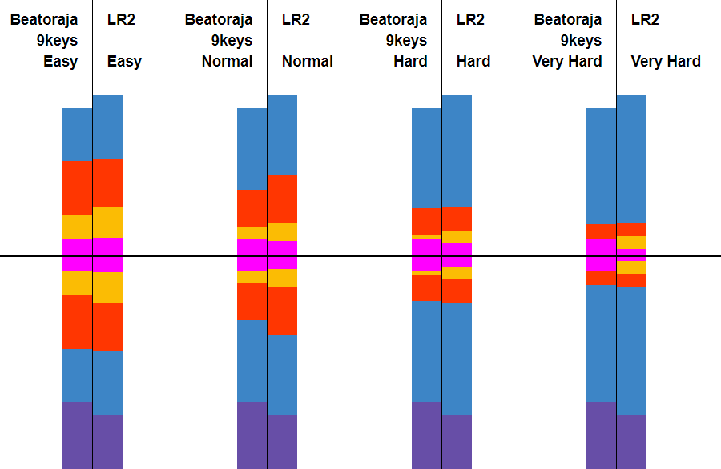
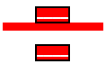
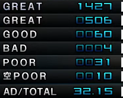
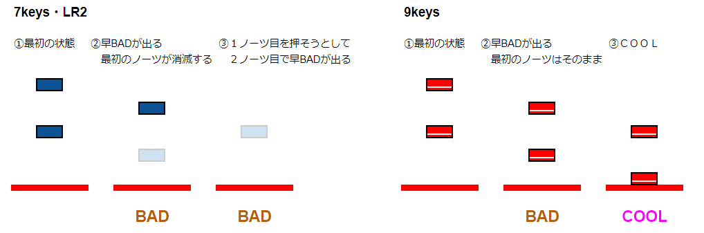

# beatoraja / LR2 运行时行为对比

> 来源：[【発狂PMS】beatoraja/LR2仕様比較まとめ (beatoraja0.8.7対応) - 発Pでハッピー](https://ralba-gear.hateblo.jp/entry/2023/11/06/141139)
> 原文开头注：已有一些 beatoraja 与 LR2 的比较文章，但没有从 9keys（PMS）视角出发的对比，故撰写本文。
> 本文对比 beatoraja 与 LR2 在血量槽、判定、LN 等引擎层面的运行时行为差异。数据主要针对 PMS（9keys）场景。
>
> 原文更新履历：
>
> - 2024/02/29 — 修正 `#DEFEXRANK` 相关错误；删除关于本家长音符的不精确描述（因可能不准确）；其他细微修正
> - 2024/02/27 — 对应 beatoraja 0.8.7 LN 判定变更；追加判定范围说明及细微修正

---

## 一、血量槽（Gauge）规格

### 符号说明

- PGREAT / GREAT / GOOD 为增加量
- BAD / POOR / 空POOR 为减少量
- `a` = 增加率 = TOTAL 值 / Note 总数
- beatoraja HARD/EXHARD 的**增加量 A** 计算方式：

```text
A = min(0.15, max(0, (2 × TOTAL − 320) / ノーツ数))
```

- LR2 HARD/EXHARD 的**减量补正 B** 计算方式：
  - Note 数 > 1000 时，按 TOTAL 值查表：

| TOTAL | ≥240 | ≥230 | ≥210 | ≥200 | ≥180 | ≥160 | ≥150 | ≥130 | ≥120 | <120 |
|-------|------|------|------|------|------|------|------|------|------|------|
| 补正  | 1.0  | 1.11 | 1.25 | 1.5  | 1.666 | 2.0 | 2.5  | 3.333 | 5.0  | 10.0 |

Note 数 ≤ 1000 时，按 Note 数分级增加减量补正：999–500 Notes 时每 Note +**0.02%**，490–250 Notes 时每 Note +**0.04%**。

### 1.1 EASY 模式

| 判定 | beatoraja 7keys | beatoraja 9keys | LR2 |
|------|----------------|----------------|-----|
| PGREAT | a | a | 1.2a |
| GREAT | a | a | 1.2a |
| GOOD | 0.5a | 0.5a | 0.6a |
| BAD | −1.5 | −1.0 | −3.2 |
| POOR | −4.5 | −3.0 | −4.8 |
| 空POOR | −1.0 | −3.0 | −1.6 |

### 1.2 NORMAL 模式

| 判定 | beatoraja 7keys | beatoraja 9keys | LR2 |
|------|----------------|----------------|-----|
| PGREAT | a | a | a |
| GREAT | a | a | a |
| GOOD | 0.5a | 0.5a | 0.6a |
| BAD | −3.0 | −2.0 | −4.0 |
| POOR | −6.0 | −6.0 | −6.0 |
| 空POOR | −2.0 | −6.0 | −2.0 |

### 1.3 HARD 模式

| 判定 | beatoraja 7keys | beatoraja 9keys | LR2 |
|------|----------------|----------------|-----|
| PGREAT | A | A | 0.1 |
| GREAT | 0.8A | 0.8A | 0.1 |
| GOOD | 0.2A | 0.2A | 0.05 |
| BAD | −5.0 | −5.0 | −6.0B |
| POOR | −10.0 | −10.0 | −10.0B |
| 空POOR | −5.0 | −10.0 | −2.0B |

**剩余血量对减少量的补正：**

| 剩余血量 | 50 | 40 | 30 | 20 | 10 |
|----------|----|----|----|----|----|
| beatoraja 7keys | 0.8 | 0.7 | 0.6 | 0.5 | 0.4 |
| beatoraja 9keys | 0.8 | 0.7 | 0.6 | 0.5 | 0.4 |
| LR2 | 1.0 | 1.0 | 0.6 | 0.6 | 0.6 |

### 1.4 EXHARD 模式

| 判定 | beatoraja 7keys | beatoraja 9keys | LR2oraja |
|------|----------------|----------------|----------|
| PGREAT | A | A | 0.1 |
| GREAT | 0.4A | 0.4A | 0.1 |
| GOOD | 0 | 0 | 0.05 |
| BAD | −8.0 | −10.0 | −12.0B |
| POOR | −16.0 | −15.0 | −20.0B |
| 空POOR | −8.0 | −15.0 | −2.0B |

> EXHARD 无剩余血量补正。
>
> HARD / EXHARD 血量增减规则在所有模式（7keys/9keys）中通用。
>
> LR2oraja 0.8.3+ 中，剩余血量从 **32** 起即施加 0.6 补正，低于 **2** 时直接 FAILED。（LR2 中血量低于 2 即失败；beatoraja 在 0 时失败。）
>
> **注意**：原文对 LR2 失败条件标记为“らしい？”（推测语气），该数据来源单一，需进一步验证。

### 1.5 血量总量·边界·初始值

| 项目 | beatoraja 7keys | beatoraja 9keys | LR2 |
|------|----------------|----------------|-----|
| 最小值 | 2 | 2 | 2 |
| 最大值 | 100 | 120 | 100 |
| 初始值 | 20 | 30 | 20 |
| 清除边界 | 80 | 85 | 80 |

- 9keys 的血量总量为 120，初始值为 30，清除边界为 85（≈70.83%），接近本家 pop'n music 的内部值 724/1024（≈70.70%）。
- 清除所需的净增加量：LR2 为 60（80−20），9keys 为 55（85−30），差距不大。



### 1.6 段位认定血量

> beatoraja 各模式也有各自的段位血量槽，但现状是几乎全部段位都采用了与 LR2 相同的血量槽，因此无需单独列出，此处省略。以下为通用段位血量规格。

| 判定 | PGREAT | GREAT | GOOD | BAD | POOR | 空POOR |
|------|--------|-------|------|-----|------|--------|
| LR2 / beatoraja 段位 | 0.1 | 0.1 | 0.05 | −2.0 | −3.0 | −2.0 |

**剩余血量补正：** 50→1.0, 40→1.0, 30→0.6, 20→0.6, 10→0.6

---

## 二、判定宽度对比

> beatoraja 的判定宽度通过 **JUDGERANK** 控制（EASY 为基准 `100%`），不同模式有不同的补正系数。
> LR2 数值为**垂直同步关闭**时的参考值。
> 本文所有判定宽度数值以 `+` 方向为**早（EARLY）**、`-` 方向为**晚（LATE）**。
>
> 注：表格中“7keys”/“9keys”对应 beatoraja 的游戏模式；LR2 无对应功能时标注为“LR2oraja”。
> 7keys 的键盘与碟盘判定宽度不同，但本文专注 PMS（9keys）场景，故省略此差异。

### 2.1 VERY EASY

| 判定 | beatoraja 7keys | beatoraja 9keys | LR2oraja |
|------|----------------|----------------|----------|
| PGREAT | ±25ms | ±20ms | ±18ms（补正为 NORMAL） |
| GREAT | ±75ms | ±66ms | ±40ms |
| GOOD | ±187ms | ±155ms | ±100ms |
| BAD | +275~−350ms | ±183ms | ±200ms |
| 空POOR | +500~−150ms | +500~−175ms | +1000~0ms |

### 2.2 EASY

| 判定 | beatoraja 7keys | beatoraja 9keys | LR2 |
|------|----------------|----------------|-----|
| PGREAT | ±20ms | ±20ms | ±21ms |
| GREAT | ±60ms | ±50ms | ±60ms |
| GOOD | ±150ms | ±117ms | ±120ms |
| BAD | +220~−280ms | ±183ms | ±200ms |
| 空POOR | +500~−150ms | +500~−175ms | +1000~0ms |

### 2.3 NORMAL

| 判定 | beatoraja 7keys | beatoraja 9keys | LR2 |
|------|----------------|----------------|-----|
| PGREAT | ±15ms | ±20ms | ±18ms |
| GREAT | ±45ms | ±35ms | ±40ms |
| GOOD | ±112ms | ±81ms | ±100ms |
| BAD | +165~−210ms | ±183ms | ±200ms |
| 空POOR | +500~−150ms | +500~−175ms | +1000~0ms |

### 2.4 HARD

| 判定 | beatoraja 7keys | beatoraja 9keys | LR2 |
|------|----------------|----------------|-----|
| PGREAT | ±10ms | ±20ms | ±15ms |
| GREAT | ±30ms | ±25ms | ±30ms |
| GOOD | ±75ms | ±58ms | ±60ms |
| BAD | +110~−140ms | ±183ms | ±200ms |
| 空POOR | +500~−150ms | +500~−175ms | +1000~0ms |

### 2.5 VERY HARD

| 判定 | beatoraja 7keys | beatoraja 9keys | LR2 |
|------|----------------|----------------|-----|
| PGREAT | ±5ms | ±20ms | ±8ms |
| GREAT | ±15ms | ±16ms | ±24ms |
| GOOD | ±37ms | ±38ms | ±40ms |
| BAD | +55~−70ms | ±183ms | ±200ms |
| 空POOR | +500~−150ms | +500~−175ms | +1000~0ms |

### 2.6 JUDGERANK 补正系数

**beatoraja 7keys** 各档位的补正系数（以 EASY=100% 为基准）：

| 判定档位 | VERY EASY | EASY | NORMAL | HARD | VERY HARD |
|----------|-----------|------|--------|------|-----------|
| 补正系数 | 125% | 100% | 75% | 50% | 25% |

**beatoraja 9keys** 的补正规则不同——PGREAT、BAD、POOR **不参与 JUDGERANK 补正**，数值固定不变。

| 判定档位 | VERY EASY | EASY | NORMAL | HARD | VERY HARD |
|----------|-----------|------|--------|------|-----------|
| 补正系数 | 133% | 100% | 70% | 50% | 33% |

> 9keys VERY HARD 下，GREAT 判定宽度（±16ms）小于 PGREAT（±20ms），即**不存在 GREAT 判定**（PGREAT 直接跳 GOOD），称为“グドバド判定”。

---

## 三、LN（长音）判定

### 3.1 终点判定宽度

| 实现 | 终点判定宽度 |
|------|-------------|
| beatoraja **9keys** | 全判定 = 对应 Note 判定宽度 **±100ms 扩展** |
| beatoraja **7keys** | PGREAT/GREAT ±100ms 扩展；GOOD ±50ms 扩展；BAD = 同普通 Note |
| **LR2** | 终点宽度 = 普通 Note 的 **GOOD 宽度**。在此范围内离键，获得与**始点相同**的判定 |

### 3.2 判定规则

- beatoraja LN 模式：始点和终点判定中**取较差的一方**
- 过早离键（早すぎ）：beatoraja **0.8.7 起**判为**早 BAD**（0.8.6 及之前判为早 POOR）；LR2 判为**早 BAD**

### 3.3 beatoraja 0.8.7+ 押し直し（Re-press）机制

- LN 按住期间意外离键时，有 **200ms** 的宽容时间（BPM150 下相当于 8 分音符间隔）
- 在此时间内**重新按住**即可恢复按压状态，视为未离键
- 一个 LN 内可以**多次押し直し**
- 7keys 等模式无此功能（宽容时间 = 0ms）
- 注意：即使尚在宽容时间内，若 LN 终点到达且实际已离键，仍以终点判定为准

### 3.4 0.8.6 及之前已修正的问题

- LN 始点不产生空 POOR
- 过早离键后不保证 BAD 以上判定，可能判为见逃し POOR
- LN 终点未按到判定端时终点判定被优先
- CN/HCN 某些条件下不执行终点判定导致无法完奏

---

## 四、`#DEFEXRANK` 与 JUDGERANK 的关系

### 4.1 `#DEFEXRANK` 的基准

- `#DEFEXRANK` 以 **NORMAL 判定**为基准（即值 `100` = NORMAL）
- **注意**：μBMSC 的 UI 中标注为 `#EXRANK`，但实际 BMS 头部命令是 `#DEFEXRANK`
- JUDGERANK（游戏中可选）以 **EASY 判定**为基准
- 两者不同。例如 9keys 下 `#DEFEXRANK 100` 等效于 JUDGERANK `70%`（NORMAL）

### 4.2 9keys 中 BAD 判定不受补正

- beatoraja 9keys 中，BAD 判定宽度**不受 `#DEFEXRANK` 影响**，固定为 ±183ms
- 因此 GOOD 判定宽度不能超过 BAD 宽度（±183ms）
- 当 `#DEFEXRANK ≥ 523` 时，GOOD 判定达到 BAD 边界后消失，GREAT 判定也随之达到 BAD 边界
- PGREAT 也不受 `#DEFEXRANK` 补正，继续增大值不再有任何变化
- 7keys 等模式的 BAD 判定受 `#DEFEXRANK` 补正，可将判定扩展到空 POOR 范围

---

## 五、其他运行时行为差异

### 5.1 空 POOR

- LR2 / 7keys：一个 Note 可在判定范围内**多次**判空 POOR
- beatoraja **9keys**：一个 Note 最多判**一次**空 POOR（本家仕様準拠）

### 5.2 BAD ハマり（BAD 锁定）

- LR2 / 7keys：先出早 BAD，再按时判定已消失，下一个 Note 的 BAD 判定被连累——即 BAD ハマり
- beatoraja **9keys**：BAD 判定后**该 Note 的判定不消失**，可再次击打，因此不会发生 BAD ハマり（本家仕様準拠）

### 5.3 Combo 持続

- LR2 / 7keys：空 POOR 不影响 Combo 计数
- beatoraja **9keys**：空 POOR **中断 Combo**

### 5.4 S 乱（S-random）

- beatoraja **7keys**：S 乱时纵连密度限制为 **40ms**（不允许更密的纵连）
- beatoraja **9keys**：S 乱**无纵连密度限制**
- LR2：也无纵连密度限制

### 5.5 判定算法选择

beatoraja 提供三种判定算法（处理同一轨道上两个 Note 同时靠近判定线时的优先级）：

| 算法 | 行为 | 说明 |
|------|------|------|
| **Combo 优先** | 优先取 GOOD 以上可判定的 Note；均可取时取下方 Note | 默认，接近 LR2 |
| **Score 优先** | 优先取 GREAT 以上可判定的 Note；均可取时取下方 Note | 接近某寺游戏 |
| **最下 Note 优先** | 无条件取下方 Note | 可能发生迟 BAD ハマり |



---

## 六、数值分析与考察

### 6.1 血量增减分析

beatoraja 开发时，9keys 的许多规格被调整得更接近本家（pop'n music）。
NORMAL 模式下空 POOR 的减少量达到 BAD 的 3 倍，这是其中之一。

**EASY 模式对比**：
LR2 的增量为 **1.2 倍**补正，而 9keys 的减量为 **0.5 倍**补正。
POOR 的减少量在 LR2 比值为 0.625 倍，即使算上增量也更容易回复。

**NORMAL 模式对比**：
GREAT 以上的增量相同。但如果 BAD 数不超过空 POOR 数的 1.5 倍，
9keys 的减少量比 LR2 更大。根据约 2000 谱面的 score.db 统计：
7 成以上谱面减少量增加，考虑 GOOD 增量后约 9 成谱面变重。



但 LR2 判定宽度不同且存在 BAD ハマり等规格差异，仅供参考。

挑战阶段的典型结果中，beatoraja 的空 POOR 比 BAD 更多出现。

**HARD 模式对比**：
beatoraja 与 LR2 的 HARD 减少量补正（即 30% 补正）的开始值和补正值不同，
这是 beatoraja HARD 被认为比 LR2 简单的原因之一。
9keys 的原始空 POOR 减少量是 LR2 的 5 倍，因此补正后减少量差异不大。

增量方面差异明显：beatoraja 中无补正的谱面 A=0.15，
增量约为 LR2 的 1.3~1.4 倍。低耐性最主要的因素在此。

HARD 逃げ是否频繁出现？并不算频繁——这是因为 NORMAL 血量槽容量
使尾杀抗性增强也有关系。

**HARD/EXHARD 的 TOTAL 值处理差异**：
beatoraja 对**增量**补正，LR2 对**减量**补正。
beatoraja 以增加率为基准，LR2 以 TOTAL 值为基准。
因此在受影响谱面数量上 beatoraja 更多：
2023 年 8 月发狂 PMS 难度表中，
beatoraja 增量补正影响的谱面：**98/994（约 9.86%）**
LR2 减量补正影响的谱面：**30/994（约 3.02%）**

LR2 HARD 超低 TOTAL 谱面时，见逃 POOR 即失败；
而 beatoraja 只会让血量不再回复。

### 6.2 血量总量分析

LR2/7keys 的清除边界为 80/100（80.00%），
9keys 为 85/120（约 70.83%）。
本家内部值为 724/1024（约 70.70%），9keys 与此一致。

净需要量：LR2 从初始到边界需 60，9keys 需 55。
由于总量增至 120，增减相对平缓，更难满血。
清除余量容量 LR2 为 20，9keys 为 35——满血时 9keys 更难死于尾杀。

> 谱面制作参考：beatoraja 9keys 中若要接近本家血量，建议以本家增量 **1.2 倍**为基准调整 TOTAL 值。

### 6.3 判定宽度分析

**EASY 判定**是主流。9keys 比 LR2 稍难出 PGREAT，GOOD 更容易出，失误率略高。
GOOD 判定宽度的差异也影响 NORMAL 血量的增量。

**NORMAL 判定**时 GOOD 宽度差距更大。9keys PGREAT 宽度固定不变，
因此比 LR2 更容易出 PGREAT，但其他判定大幅收紧，
9keys 的接续难度上升。

看似 9keys BP 数会增加，但 LR2 前方大幅延伸的空 POOR 判定
反而导致 LR2 卷込み失误更多。

**关于 Slow POOR 和 VERY HARD**：
定义上 SLOW 方向也存在空 POOR 判定，但 9keys 所有判定模式下
BAD 判定宽度更窄且 BAD 不受补正值影响，因此空 POOR 不出现。
7keys 等模式在 HARD 级别以上时 BAD 比空 POOR 更宽，因此会出。

**グドバド判定**：9keys VERY HARD 下 GREAT 宽度比 PGREAT 更窄，因此不出 GREAT（俗称不黄）。

### 6.4 JUDGERANK 与 #DEFEXRANK 的差异

**JUDGERANK**（游戏中可选）以 **EASY** 为基准：
7keys：[125%, 100%, 75%, 50%, 25%]（POOR 不参与补正）
9keys：[133%, 100%, 70%, 50%, 33%]（PGREAT、BAD、POOR 不参与补正）

9keys 的补正规则是本家 COOL 宽度固定不变的做法：
PGREAT、BAD、POOR 不受 JUDGERANK 影响。9keys 的 VERY EASY 和 VERY HARD
无本家参考值，参考了其他 BMS 玩家。

**#DEFEXRANK** 以 **NORMAL** 为基准（值 100 = NORMAL），与 JUDGERANK 不同。
`#DEFEXRANK 100` 在 9keys JUDGERANK 换算中为 `100 × 0.7 = 70%`，
即 NORMAL 判定宽度。beatoraja 练习模式可调的是 JUDGERANK，需注意区分。

**#DEFEXRANK 的 BAD 限制**：
无论如何扩展，判定宽度**不能超过 BAD 宽度**。
9keys 下 BAD（±183ms）不参与 `#DEFEXRANK` 补正，
因此 GOOD 无法超过 BAD 宽度。当 `#DEFEXRANK ≥ 523` 时，
GREAT 也达到 BAD 宽度，GOOD 判定消失。
PGREAT 不参与补正，此后继续增大值无变化。
7keys 等模式 BAD 参与补正，可将判定扩展到空 POOR 范围。

### 6.5 BAD ハマり与空 POOR 机制

**BAD ハマり（BAD 锁定）发生原因**：
对一个 Note 打出早 BAD 后，再次击打时该 Note 判定已消失，
下一个 Note 的 BAD 判定被连带——这就是 BAD ハマり。
本家不存在此现象，因此 9keys BAD 判定后**不消失**，可再次击打。



**空 POOR 计数**：
LR2/7keys 在一个 Note 判定范围内可**多次**判空 POOR。
9keys 一个 Note 最多判**一次**空 POOR（本家仕様準拠）。

### 6.6 Combo 持続

LR2/7keys：空 POOR 不中断 Combo。
beatoraja 9keys：空 POOR **中断 Combo**，因此全连更难。

> 注：有报告称 9keys 出空 POOR 后仍显示全连——这是部分结果皮肤 Bug，
> 空 POOR 单独出现时错误显示。出现该情况时请以 IR 或选曲画面灯为准。

### 6.7 S 乱（S-random）

beatoraja 7keys：纵连密度限制 **40ms**。
beatoraja 9keys：**无纵连密度限制**，微偏移谱面会毫不留情地产生纵连。
LR2：也无纵连密度限制。

> LR2PMS 使用 S 乱时，必定有一个 Note 被分配到无法按到的轨道？
> 导致强制见逃 POOR，全连不可能。这是已知 Bug。

本家 S 乱因算法不同有一定规律性可预测谱面，但 beatoraja 的 shuffle 方式不同，不产生同样现象。

---

## 七、参考来源

- [beatoraja GitHub - 判定/血量实现源码](https://github.com/exch-bms2/beatoraja/tree/master/src/bms/player/beatoraja/play)
- [IIDX LR2 beatoraja differences](https://iidx.org/misc/iidx_lr2_beatoraja_diff)
- [bemaniwiki - pop'n music peace 系统相关](https://bemaniwiki.com/?pop%27n+music+peace/%A5%B7%A5%B9%A5%C6%A5%E0%B4%D8%CF%A2)
- [空 BAD 仕様について](https://w.atwiki.jp/asagaolabo/pages/897.html)
- [LR2 判定宽度（垂直同步 ON/OFF）](https://twitter.com/n13092s/status/908795911286878208)
- [lr2oraja Readme](https://github.com/wcko87/lr2oraja/blob/readme/README.md)

---

## 八、作者余談（原文个人感想）

以下内容来自原文作者的亲身感触，原文标记为“余談”。

**关于血量槽选择**：

- beatoraja 的 NORMAL 血量槽作为清除目标实用——接近本家规格，且有尾杀抗性
- NORMAL 与 HARD 的难度差较小，配合 GAS（自动调节速度）导致文件夹清完时多半已有 HARD 清除
- 推荐以 EX-HARD 作为下一个目标，对本家辛ゲージ意识下的罚数减少很有用

**推荐使用 beatoraja**：

- 更新持续进行
- 更接近本家行为
- PMS 难度表以其为基准
- 可使用 IR（Internet Ranking）
- 如觉得 EASY/HARD 太简单，可将 NORMAL(HARD) 与 EX-HARD 作为目标线

> 原文引用了 PMS Database 作为 BMS 播放器导入指南。
