# BMS Scroll ギミック 制作指南

> **来源**：[BMS Scrollギミックの作り方 - numuto (note.com)](https://note.com/numuther/n/n57bf895e7969)
> 本文是 BMS 谱面滚动特效（Gimmick）的实践教程，涵盖 Scroll / BPM / Stop 三类基础命令的组合用法。
>
> **引用约定**：标注 `→ 详见 [xxx.md](xxx.md)` 的内容表示该命令或概念已在现有文档中定义，本文侧重其实战组合用法，不重复格式细节。
>
> **原文简介**：作者 numuto 自 2022 年 4 月下旬开始制作 Gimmick 谱面，至 2022 年 10 月左右集中创作。
> 本文使用自制 BMS 曲目「Odyssey in the sky」作为示例，讲解基础 Gimmick 技法。
> 实际谱面解说因篇幅原因留待后续文章。
>
---

BMS 的 Gimmick 类命令可分为三大类：**Scroll**、**BPM**、**Stop**。

- **Scroll**：改变谱面流过的**宽度**（※ Scroll ≠ 速度变化，这很重要！）
- **BPM**：改变曲子的**流速**
- **Stop**：在指定时间内**暂停**谱面滚动

> **Scroll ≠ 速度**：这是最重要的概念。Scroll 改变的是谱面流过的**宽度**，时间不变，所以看起来像加速/减速。

---

## 一、三种基础 Gimmick

### 1.1 加速·减速

加速和减速是最基础的 Gimmick。以下分别展示使用 Scroll、BPM、Stop 实现加速·减速的方法。

#### Scroll 方式

Scroll 改变宽度而不改变时间，因此无需移动 Note 位置，这是 Scroll 方式的最大优点。

```bms
; Scroll 值变化：1 → 0.5 → 0.25 → 0.5 → 1 → 2 → 3 → 2
#SCROLL01 1
#SCROLL02 0.5
#SCROLL03 0.25
#SCROLL04 0.5
#SCROLL05 1
#SCROLL06 2
#SCROLL07 3
#SCROLL08 2
```

→ `#SCROLL` 语法详见 [beatoraja-extensions.md](beatoraja-extensions.md#SCROLL)

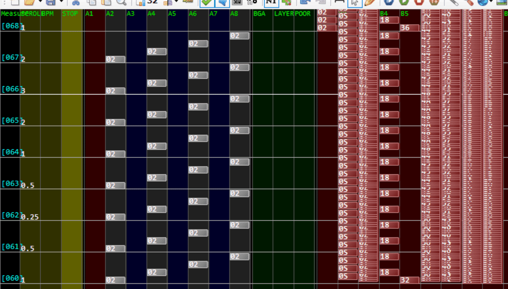

[▶ Scroll 加速/减速演示](https://youtube.com/watch?v=WZBmdwDCHqM)

#### BPM 方式

BPM 是改变曲子流速的命令，与 Scroll 不同——单纯改变速度会使音乐变快或变慢。因此必须根据变化的倍率**压缩或扩展整个小节**来补偿。LR2 不支持 Scroll Gimmick，所以 LR2 兼容的谱面只能采用 BPM 方式。

```bms
; BPM 值变化：150 → 75 → 37.5 → 75 → 150 → 300 → 450 → 300
#BPM01 150
#BPM02 75
#BPM03 37.5
#BPM04 75
#BPM05 150
#BPM06 300
#BPM07 450
#BPM08 300
```

→ 详见 [memo/09-header-commands-audio-and-bpm.md](../memo/09-header-commands-audio-and-bpm.md)

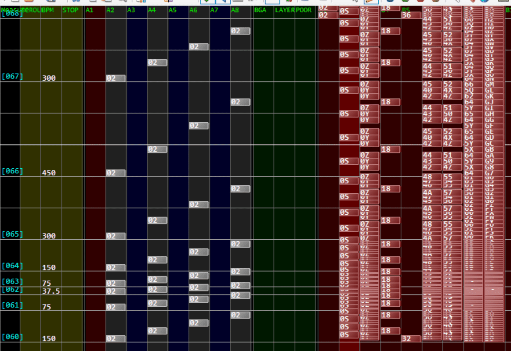

[▶ BPM 加速/减速演示](https://youtube.com/watch?v=WcokWqlH9Ks)

#### Stop 方式

Stop 是谱面暂停命令。以曲子的基准 BPM（编辑器右上角显示的值）为基准，**1 小节 = 192 个 stop 单位**。

用暂停模拟减速的原理很简单：超高速连续暂停拟似低速。基准 BPM 下 1 小节 = 192：

- **1/2 倍速**：stop 值设为 96（即 192/2），剩余 96 用 `#xxx02` 压缩
- **1/4 倍速**：stop 值设为 144，剩余 48 用 `#xxx02` 压缩
- **2 倍速**：stop 值设为 **-192**（负值），剩余 384 扩展

负 stop 在编辑器中无法直接输入，需要把 `.bms` 文件用记事本打开手动编辑。

```bms
#STOP01 96     ; 1/2 倍
#STOP02 -192    ; 2 倍（需手写）
```

Stop 和 BPM 一样是调整速度的手段，因此也需要对整体进行压缩/扩展。

→ 详见 [memo/09-header-commands-audio-and-bpm.md](../memo/09-header-commands-audio-and-bpm.md)

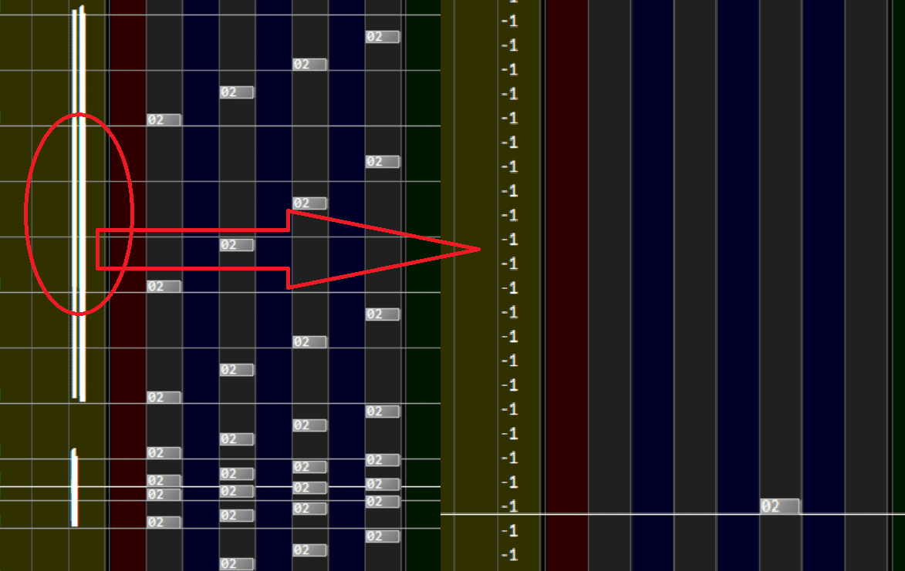

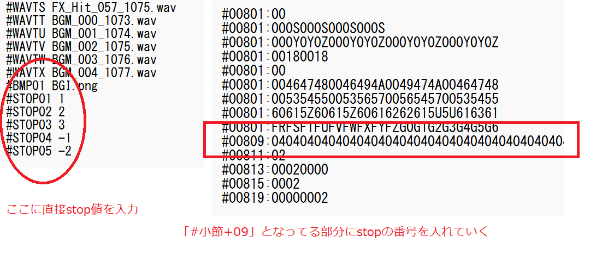

[▶ Stop 加速/减速演示](https://youtube.com/watch?v=9VI3dhD32nY)

---

### 1.2 ワープ（Warp）

Warp 是让 Note 瞬间出现在判定线上或消失的特效。它也是 Gimmick 不可或缺的元素——地雷突然变成实 Note、LN 突然消失等效果都需要 Warp。

#### Scroll Warp

让两个 Note 之间的 scroll 宽度极大化，产生瞬间移动的效果。因为 scroll 是调节 Note 之间宽度的命令，只要把宽度弄到极大，看起来就像 Warp。

```bms
#SCROLL01 100001
#001SC:01
```

→ `#SCROLL` 语法详见 [beatoraja-extensions.md](beatoraja-extensions.md#SCROLL)

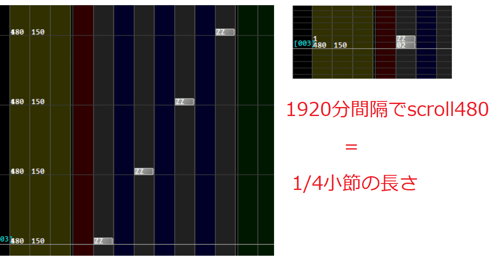

[▶ Scroll Warp 演示](https://youtube.com/watch?v=u5w32ATOkQM)

#### BPM Warp（100001 倍技术）

使用 **100001 倍** BPM 使 Note 瞬间移动到目标位置。

> 为什么是 100001 而不是 100000？因为在 LR2 上，100001 倍时**显示 BPM 不变**（不显示为极值），这是一个实用技巧。

```bms
#BPM01 100001
#00108:01
```

BPM 改变的是速度而非宽度，所以需要相应地移动整个谱面的位置。

配合 Stop 补偿：

```bms
#STOP01 30000    ; 100001 倍 BPM 下 3/1920 小节的补偿量
// 计算过程：192 × 100001 ÷ 1920 × 3 - 192 ÷ 1920 × 3 = 30000
```

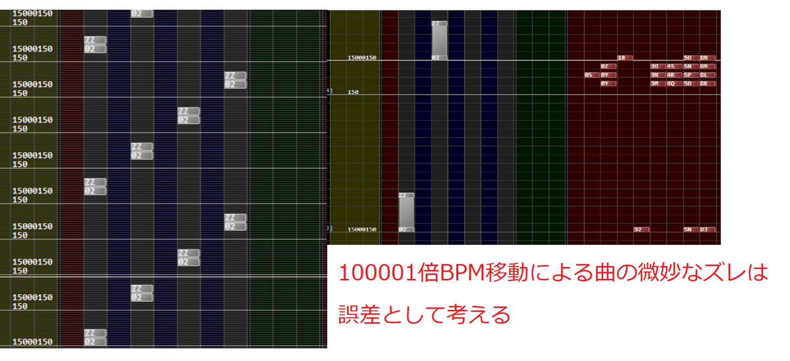

[▶ BPM Warp 演示](https://youtube.com/watch?v=gvsWdQy0ryQ)

#### Stop Warp

老实说，理论上 Stop 也可以用巨大的负值实现 Warp，但只限 LR2，
而且专门用 Stop 来做 Warp 并不推荐。
如果实在需要在 LR2 上实现 Gimmick 并且绝对不想改变 BPM，可以考虑使用
——例如用 100001 倍做 1 小节 Warp 时：`stop = 192 - 100001 × 192 = -19200000`。
在此略过。

---

### 1.3 アニメーション（Animation）

Animation 是 Gimmick 谱面的重要看点！地雷逐渐出现、意想不到的运动、奇妙的图案……所有表现手法本质上都是**帕拉帕拉漫画（翻页动画）**，没有特殊的命令让它们动起来。翻页动画 × 重复 Warp——觉得麻烦就对了，确实很麻烦（笑）。

#### BPM 逐帧动画

先做一个地雷从下到上匀速直线运动的动画。首先要决定动画的 fps。

**fps 计算示例（BPM=150）：**

- 1 小节 32 分割：240/150 秒内 32 帧 ≈ 20fps
- 1 小节 64 分割：40fps
- 1 小节 96 分割：60fps

上述分别以 2 小节为单位展示 16 分割（10fps）、32 分割（20fps）、64 分割（40fps）、96 分割（60fps）。

Warp 间隔为 1 小节时，64 分割的 Stop 值：

```text
stop = 192 × 100001 ÷ 64 − 192 = 299811
```

（这里的 −192 是把基准 BPM 的 1 小节长度移走的意思，
如果 Warp 间隔是 1/2 小节就要 −96。）

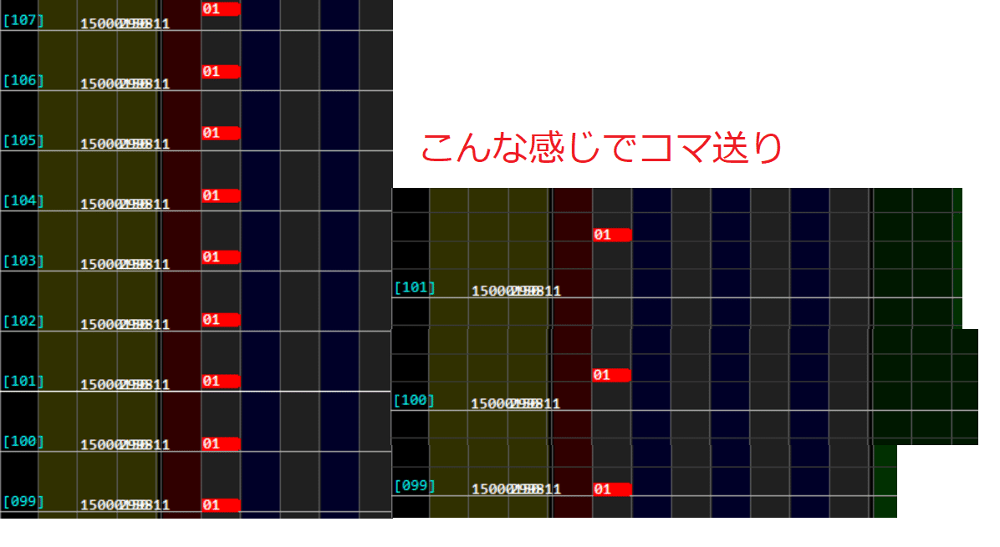

[▶ BPM 动画演示（16/32/64/96 分割比较）](https://youtube.com/watch?v=eTtdYJ2VE-g)

#### Scroll 动画

理论上 Scroll 也可以做动画，但基本不推荐。因为看上去非常繁琐，
而且 LR2 上动画不工作。动画的本质是“帧”和“送”，
用 Stop 做帧、用 Scroll 做送时，scroll=0.0 使谱面宽度为零，
看起来完全停止，但曲子的流速不变。但单纯的 scroll=0.0 只在判定线上停止，需要额外的工夫。

空中地雷停止的一帧意味着“空中停止的地雷在下一瞬间高速移动到判定线消失”，需要用 Scroll 来表现这个运动。在下一个 Note 到达之前插入巨大的 Scroll 值来扩展宽度即可。

通常用 Scroll + BPM 变化 + Stop 来表现（没有 Scroll 也可以，但编辑器限制 999 小节的长度，超出后无法编辑，因此压缩小节长度是有意义的节省手段）。

→ SCROLL=0 的说明详见 [bmse-compatibility.md](bmse-compatibility.md#SCROLL--SPEED-扩展)

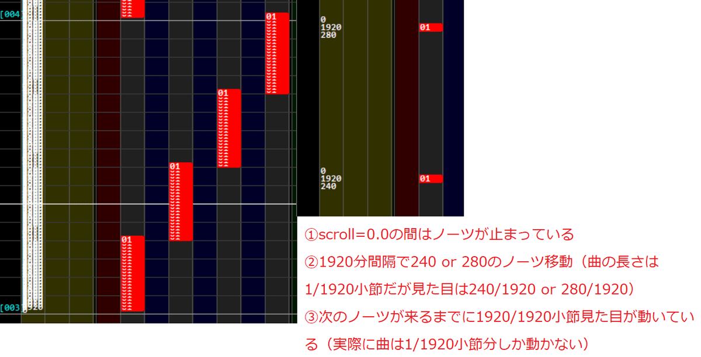

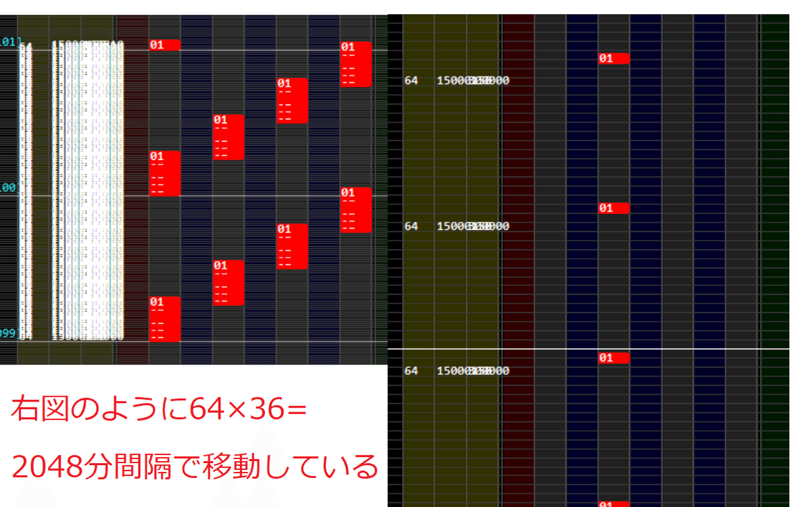

---

> 以上是基础 Gimmick 的全部内容。“就这些？”——确实，各种花哨的 Gimmick 本质上就是这几种基础技法的组合。
> 真正厉害的人还会使用更难理解的技术，但它们不属于基础 Gimmick 的范畴。
>
> 接下来进入正题，围绕 oraja Gimmick（即 Scroll Gimmick），将作者积累的经验和技巧整理如下。

## 二、Scroll Gimmick 高阶技巧

以下技巧依赖 beatoraja 对 `#SCROLL` 的支持（也称为 oraja Gimmick）。另外由于是 beatoraja 限定，不可见 Note 也被纳入基础技巧中。

### 2.1 空中停止（Mid-air Stop）

让 Note 悬停在判定线（Note 出现判定位置）上方，直到敲击瞬间才移动到判定线。
例如一些迷宫地带的演出就使用了这个技巧。

原理是利用 scroll=0.0 让谱面宽度为零、Note 看似停在空中。
敲击之前保持 scroll=0.0，到敲击前瞬间插入 Scroll 值让 Note 瞬间移动到判定线。

**重要原则**：Scroll 变化不能局部应用——动一处就会影响后面所有的谱面。
因此瞬间移动多少，就必须同样地**暂时向后补偿多少**。这是 Scroll Gimmick 最关键的地方。

**示例**：在 1/16、1/8、3/16、1/4 小節位置放置空中停止 Note。
在 Note 敲击前的 1920 分间隔中分别插入 scroll 120、240、360、480，
它们分别对应 120/1920、240/1920、360/1920、480/1920 小节的宽度，看起来就像瞬间移动。
然后立即补偿：

```bms
; 120/1920 小節份的瞬間移動，然后补偿
#SCROLL01 120
#SCROLL02 -120    ; 复原
#SCROLL03 240     ; 240/1920 小節份
#SCROLL04 -240    ; 复原
; ...
```

**结合地雷具現化**：地雷从左到右依次在 120/1920、240/1920、360/1920、480/1920 显示，
但无法同时移动，于是逐个移动：第一个移动 120 后 -120 补偿，下一个移动 240 后 -240 补偿……
即 120 + (-120) + 240 + (-240) + 360 + (-360) + 480 = 480。

**关于 Note 重叠**：beatoraja 的特性是 scroll=0.0 时 Note 重叠，后方的 Note 显示在前方之上。
因此如果直接用实 Note，地雷会悬浮在空中而实 Note 不可见。视频中改为不可见 Note 来让实 Note 可见。

**后续处理**：不可见 Note 部分流过之后，需要插入 scroll=1000 之类的值，
否则下一个 Note 会过早显示，失去谱面切换的视觉感。

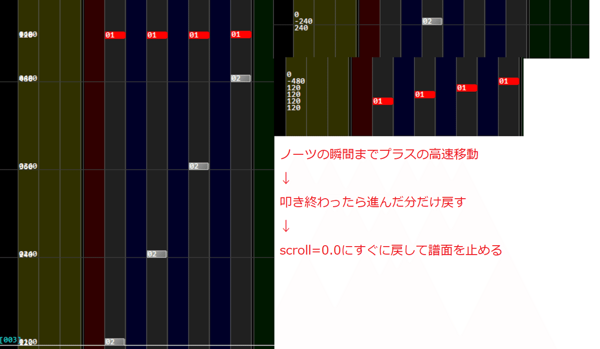

[▶ 空中停止演示（迷路地带）](https://youtube.com/watch?v=c0ilz53wx8Y?t=55)

### 2.2 逆走（Reverse Scroll）

顾名思义谱面逆向滚动。用 scroll=-1.0 来实现——但单纯 = -1.0 的话，Note 从判定线下方出现，极难游玩。

**解决方法**：让谱面逆走到上方，然后瞬间移动到判定线即可。

例如绿数字 300 时，Note 出现到判定线到达需要 500ms。BPM=150 时，`0.5 / (240/150) = 5/16` 小节份会瞬间显示在画面上。因此逆走 5/16 小节后瞬间移动到判定线，看起来就很自然。

```bms
; 推荐绿数字 300 时，BPM150 下 5/16 小節逆走
#SCROLL01 -1
#001SC:01
; ...5/16 小節后...
#SCROLL02 10000    ; 瞬间回到判定线
```

使用逆走时，建议在谱面信息中标注推荐绿数字。如果看到多余的小节线，后半顺走部分的小节线可能提前流到了上方——在某个位置插入 scroll=10000 即可解决。

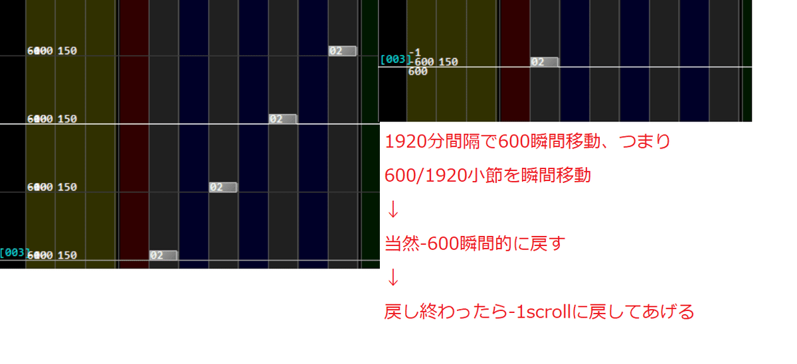

[▶ 逆走演示（scroll=-1）](https://youtube.com/watch?v=M7sjnR2RjBc) | [▶ 修正版](https://youtube.com/watch?v=4ZjRzJsqBVw)

### 2.3 Scroll 出现/消失 Bug（beatoraja 特定）

实 Note 看起来固定不动，但不知为何 Note 在变化——这就是 beatoraja 上
Scroll 的出现/消失 Bug 制造的 Gimmick。
没有正式的名称，暂且称为“Scroll 出现/消失”Bug。

**原理**：24 分间隔配置 Note 和不可见 Note。
基本做法是用 scroll=0.0 停住整体，临到判定前高速移动，移动后立即补偿。
空中固定位置取决于高速移动的大小。示例谱面中依次采用 80/1920、160/1920……560/1920。

**关键数值 561**：将这个值改为 **1561**——Note 消失了！
这就是 beatoraja 的 Scroll 出现/消失 Bug。
假设原因是 Scroll 的绝对值过大（如 +1516、-1481），超过某个阈值后 Scroll 效果不可见。
调整绿数字或 HS 可以改变这个阈值
——例如 scroll=1561 时提高绿数字或降低 HS，演出又会变为可见。

因此像 1008 制作的 Maxi -C0ffee- 这类谱面，需要事先指定合适的绿数字和白数字
（Note 判定位置的显示设定值）才能让 Gimmick 正确发动。没有固定公式，只能手动试探。

**渐进出现**：用 scroll=0.0 无法实现渐进出现，需要改用 scroll=0.0625 等微小正值。
在 scroll=0.0625 下使用 561 值，可以获得平滑出现的视觉效果。
Scroll 值、SUD（遮盖）、HS、绿数字等都会影响效果，
建议在谱面信息的 Artist 栏等位置注明推荐设置。

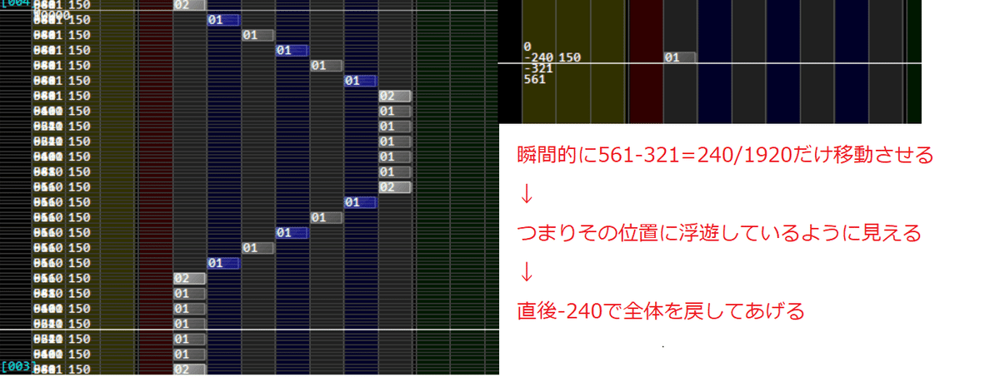

[▶ Scroll Bug 代表性演示](https://youtube.com/watch?v=GRCdFoqU_R4?t=76)

> 此行为无固定公式，需根据目标绿数字/SUD 手动调整阈值。

### 2.4 非动画具現化（Non-animation Manifestation）

动画具現化是通过瞬间移动让地雷→实 Note 变化。Scroll Gimmick 也可以做动画，但还有一种**不依赖逐帧动画**的具現化方法。

原理极其简单：将实 Note 和地雷 Note **分离放置**，通过 Scroll 变化使它们在判定线上**重叠**。Note 重叠时，**后方的 Note 显示在前方之上**。

- **地雷→实 Note**：地雷放在前方（后方），实 Note 放在后方（前方）
- **实 Note→地雷**：实 Note 放在前方（后方），地雷放在后方（前方）

```bms
; 地雷→实 Note 具現化
; 地雷后于实 Note 240/1920 小節，scroll 补偿 -238
; （因为 2/1920 小節用于执行 scroll 命令本身）
```

**补偿的详细解释**：用负 Scroll 将地雷 Note 向上高速移动，
使其在下方显示并与前方的实 Note 重叠。
但地雷实际在实 Note 上方 240/1920 小节处，scroll 补偿却是 -238/1920。
这是因为补偿 Scroll 命令开始执行时，地雷 Note 已经在判定线下方 238/1920 小节处了。
随后用 +240 补偿是因为“2”和“-240”两条命令占用 2/1920 小节的间隔。
238/1920 后退期间本应前进 2/1920，所以补偿量 238 不足，需要 238+2=240。
如果基准 scroll=0.0，则 240 无需加 2，用 238 即可。
基准 scroll=0.0625 时当作误差处理。

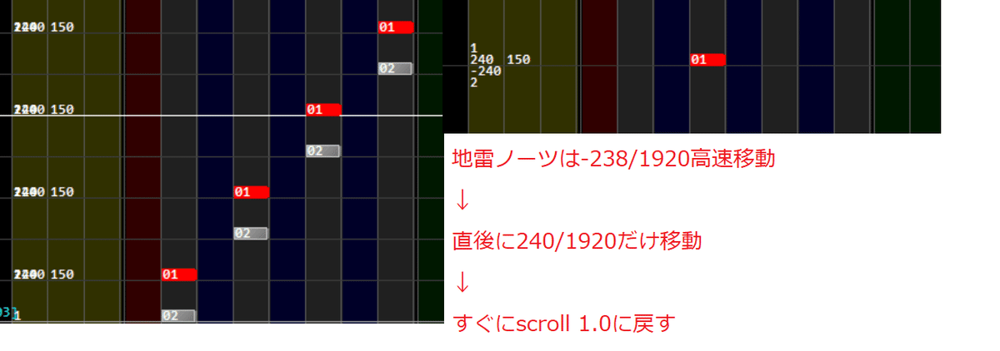

[▶ 非动画具現化演示](https://youtube.com/watch?v=iYx8iFZrCiE) | [▶ 续篇](https://youtube.com/watch?v=xA4OVeKh4PU?t=28)

> 效果受绿数字和 SUD 影响，建议在谱面信息中推荐设置。

### 2.5 部分ワープ（Partial Warp）

LN 或伪 LN（橙色棒）在一瞬间消失——这就是部分 Warp。

做法：用 1920 分间隔的 Scroll 将 LN 拉伸，瞬间用 100001 倍 BPM 让 LN 到达终点。
以瞬间消失的 Scratch LN 为例：用 1920 分间隔的 240 scroll 使 LN 呈现 8 分长度的外观，
但 100001 倍 BPM 瞬间到达终点，LN 瞬间消失。

```bms
; 240/1920 小節 scroll 拉伸 LN
#SCROLL01 240
#SCROLL02 -238    ; 补偿（基准 scroll=1.0 时，每个命令占用 2/1920 小節）
#STOP01 30000     ; 100001BPM × 3/1920 小節的补偿
```

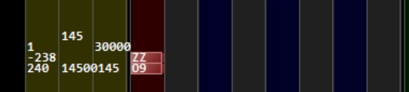

[▶ 部分ワープ演示](https://youtube.com/watch?v=kPbb6sQC4iI?t=13)

### 2.6 マイナス Scroll アニメーション（Negative Scroll Animation）

Scroll Gimmick 中最有趣（一点也不为过）的就是负 Scroll 动画！地雷明明存在却可以正常击打 Note。

**原理**：实 Note 部分和动画部分被清晰地分开。前半段只有实 Note，后半段只准备动画。实 Note 部分用 scroll=-1 配合 BPM=100001 倍制作动画，动画部分则整体 scroll=1 让一切超高速流过。

实 Note 结束后，超大量动画以超高速流过，但实 Note 部分的 -1 Scroll 诱导本应之后流过的动画提前从下方流向画面上方。实际上结束击打后瞬间有海量地雷和不可见 Note 奔涌而过。

```bms
; 前半：实 Note（scroll=-1，BPM=100001）
; 后半：动画素材（scroll=1，超高速流过）
```

**关键点**：动画在负 Scroll 下流动，所以**上方的帧先出现**。需要把**第一帧放在最上方**，**最后一帧放在最下方**，与普通 BPM 动画的帧顺序相反。

试过把实 Note 部分 scroll=1.0、动画部分 scroll=-1.0，但 beatoraja 的特性下似乎无法正确显示。具体原因未知。

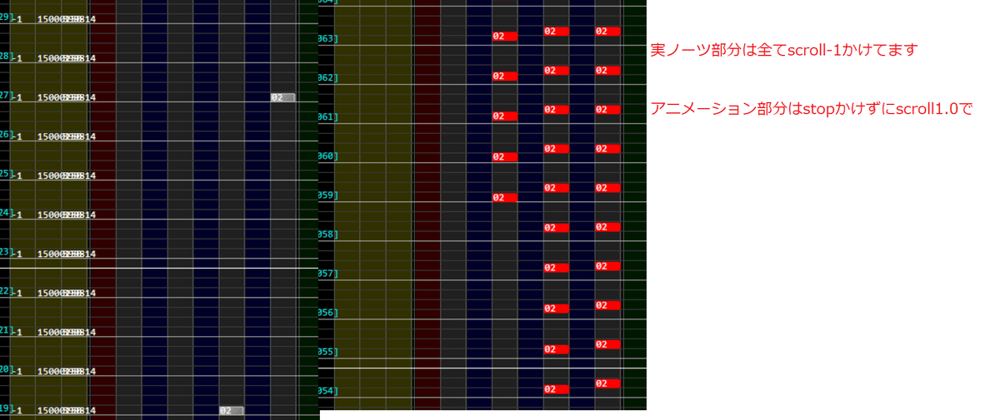

[▶ 负 Scroll 动画演示 1](https://youtube.com/watch?v=Cvcerl_K1LE)
| [▶ 演示 2](https://youtube.com/watch?v=LMItjD1-No4?t=65)
| [▶ 演示 3](https://youtube.com/watch?v=lNg8L4ItAUk?t=44)

---

**外部链接：**

- 示例 BMS 曲目「Odyssey in the sky / numuto」：[pupuly 下载](https://pupuly.nekokan.dyndns.info/bms/v/228) | [SoundCloud](https://soundcloud.com/kgisjhy3c6t6/odyssey-in-the-sky)

以上是 Scroll Gimmick 的全部基础内容，本质上就是这些基础技法的组合。真正厉害的人还会使用更难理解的技术，但它们不属于基础 Gimmick（笑）。

Scroll Gimmick 的核心原则：

1. **Scroll 是宽度变化**，不是速度变化——无需移动 Note
2. **BPM 是速度变化**——需压缩/扩展小节补偿音乐时长
3. **Stop 是暂停**——负值可跳跃式前进
4. **Scroll=0.0** 可冻结 Note
5. **负 Scroll** 可逆走
6. **100001 倍 BPM** 是 warp/动画的常用技巧
7. **Scroll 大绝对值** 在 beatoraja 上可隐藏 Note
8. **每次变化后必须补偿**，否则后续 Note 位置偏移

> **原文感言**：以上是全部基础 Gimmick 的介绍。本质上都是基于这些技法的展开，只要有毅力就能做到。
> 真正精彩的动画需要逐帧制作，非常辛苦。希望未来有机会用实际谱面进行解说。
> 希望对大家有所帮助。各位，请一定试试制作 Scroll Gimmick！我嘛……看心情再做了笑
