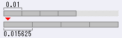
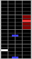
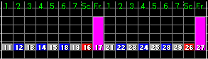

# BMS 格式谱面文件扩展名

## 大要

- 典型的扩展名如下：

  **注意：关于这些扩展名的由来存在多种说法，我无法对此负责。这些与其说是缩写，不如说是通称。**

  - **BMS** (Be-Music Script): Be-Music Script
    ([hatena](http://d.hatena.ne.jp/keyword/bms),
    [wiki[ko]](https://ko.wikipedia.org/wiki/Be-Music_Script)) |
    Source ([wiki[en]](https://en.wikipedia.org/wiki/Be-Music_Source)) |
    Source file ([spec](http://bm98.yaneu.com/bm98/bmsformat.html),
    [wiki[ja]](https://ja.wikipedia.org/wiki/BMS_%28%E9%9F%B3%E6%A5%BD%E3%82%B2%E3%83%BC%E3%83%A0%29)) |
    Data Format '98 ([bm98after](http://bm98.yaneu.com/bm98/bm98after.html),
    [wiki[ja]](https://ja.wikipedia.org/wiki/BMS_%28%E9%9F%B3%E6%A5%BD%E3%82%B2%E3%83%BC%E3%83%A0%29))
  - **BME** (Be-Music Extend format): Be-Music Extend format
  - **BML** (Be-Music Longnote format): Be-Music Longnote format
  - **PMS** (feeling-PoMu Script): Po-Mu Script | feeling-PoMu Script (?)

- 近年来，这些扩展名几乎仅为了向后兼容而存在。
- 不支持谱面所需通道的实现会根据扩展名进行过滤。
- 现代实现都支持所有这些扩展名，因此过滤的必要性已经降低。
- 对于现代实现，我们完全可以将所有谱面的扩展名改为 BMS。
  **（但如果是 9KEYS，我们必须将扩展名改为 PMS（\*.pms）。否则，fgt++/fgt# 会将其作为 BMS-DP（10KEYS）显示。LR2 会将 BME-SP 类型的 9KEYS 直接显示为 BME-SP。）**
- 不过，在 Windows 资源管理器中寻找谱面等场合，扩展名仍然有用。
  - "**5K** is BMS."
  - "**7K** is BME."
  - "**LN** is BML."
  - "**9K** is PMS."
  
  对于了解 BMS 上下文的人来说，理解这种命名很容易。（这些是包含误解但易于理解的总结。）

- 除此之外，还存在源自 BMS 的格式。详情请参考 [BMS 扩展名表](http://itkhps.web.fc2.com/bmsk.html)。
  - MGQ: 使用长音符通道的 24KEYS BMS。"Music Game Quest" 构思了类似 KEYBOARDMANIA 的玩法。
  - MBM: MacBeat MOD。使用 `#WAVCMD` 的 BMS 谱面必须将扩展名改为 MBM。
  - EMS: AngelicPianizm 类型的 24KEYS BMS。KbMediaPlayer (bmse.kpi) 至今仍支持此格式。
  - KMS: KeyMani 类型的 24KEYS BMS。
  - BAS: BMS-2 Format (BM-A4 & beat arranger 扩展)
  - PHX: PHOENIX 类型（详情不明）
  - MGF: beatmaster [standard] 类型（详情不明）
  - BMB: beatmaster [bms] 类型（详情不明）
  - PMB: beatmaster [doremimania 类型的 PMS]（详情不明）
  - D2B: beatmaster [D2R] 类型（详情不明）
  - DEE:（详情不明）

  近年来这些几乎见不到了。但以下格式经历了原创发展，至今仍在发展过程中。
  - **DTX**: DTXMania (DrumMania 的高度发展形)
  - GDA: BandJam (类似 GuitarFreaks & DrumMania 的类型)
  - G2D: SessionStream (GDA 扩展)
  - GFS: Guitar Friends 98

  DTX 系列的详情请参考官方网站：
  [http://dtxmania.net/wiki.cgi?page=qa_dtx_spec_e](http://dtxmania.net/wiki.cgi?page=qa_dtx_spec_e)

- 谱面文件的典型扩展名将在下一节详述。

## BMS

BMS 起源于对 *beatmania* 的模仿。
([https://en.wikipedia.org/wiki/Beatmania](https://en.wikipedia.org/wiki/Beatmania))

它拥有 5 个键盘 (x2) 和 1 个转盘 (x2)。

**历史沿革：**

- **1997-12-10**: *beatmania* 开始运营。
- **1998-05-04**: Urao Yane 向 NBK 提出了 "**Be-Music Data Format**" 草案。这就是今天 BMS 格式的基础。
- **1998-05-05**: NBK 基于 Urao Yane 的草案创建了 House Music 的谱面文件，并将其提交给 Urao Yane。
- **1998-06-07**: 在游戏中心 "Chirucoporto" 举办的线下聚会中，Urao Yane 展示了 *BM98* ver 1.00。
- **1998-06-08**: Urao Yane 创建了[他自己的主页](http://bm98.yaneu.com/)，并在网上公开了 BM98 ver 1.03。
- **1998-06-28**: Kazutoshi Takata 公开了 **BMS Viewer** Version0.8。
- **1998-07-10**: Urao Yane 暂时停止了 BM98 的公开。
  - 关于这一经过，Urao Yane 本人撰写的文档：[《Game Labo》（1999 年 4 月 16 日发售的书籍）中公开的原稿](http://bm98.yaneu.com/bm98/gamelab9904.txt)
  - 由于各种原因引起了混乱，Urao Yane 于 1999 年永久停止了 BM98 的公开：["关于今后 BM98 活动的方针"](http://bm98.yaneu.com/bm98/bm98after.html)
- **1998-10-20**: TIX 公开了 **BMS Creator** v0.02.02（[改版履历](http://www.doits.jp/mediamaximum/contents/bm98/onlinemanual/version.html)）。……我们终于从文本编辑器中解放了。
- **1998-11-26**: Urao Yane 展示了 [BMS Format Specification](http://bm98.yaneu.com/bm98/bmsformat.html)。

|origin|BM98|
|--------|------|
|support|BMS 的全部实现|
|header|`#PLAYER n`, `#GENRE string`, `#TITLE string`, `#ARTIST string`, `#BPM n`, `#MIDIFILE midiFilename`, `#PLAYLEVEL n`, `#RANK n`, `#VOLWAV n`, `#WAVxx audioFilename`, `#BMPxx imageFilename`, `#TOTAL n`, `#RANDOM n`, `#IF n`, `#ENDIF`, `#ExtChr SpriteNum BMPNum startX startY endX endY [offsetX offsetY [x y]]`|
|channel|`#xxx01-06`, `#xxx11-17`, `#xxx21-27`, `#xxx31-36`, `#xxx41-46`|

各标头的详情另述。

### 各通道详情

|number|object to change|remarks|
|--------|-----------------|---------|
|`#xxx01`|BGM|将在 `#WAVxx` 中定义的文件作为自动播放的音频对象放置。|
|`#xxx02`|小节长|`#xxx02` 控制拍子（[Metre (music)](https://en.wikipedia.org/wiki/Metre_%28music%29)）。 - 小节长由整数或浮点数指定。   - 值 1 为 4/4 拍。`#xxx01:11223344` // 相当于 4 个四分音符   - 值 2 为 8/4 拍。`#xxx01:1122334411223344` // 相当于 8 个四分音符   - 值 0.75 为 3/4 拍。`#xxx01:112233` // 相当于 3 个四分音符   - 值 0.015625 为 1/64 拍，相当于 1 个 64 分音符的长度。BMSE 可编辑的最小长度   - 值 0.01 相当于 4 拍小节的 1%。BMSE 以 0.01625 倍数处理，会四舍五入        - BMSE/beditor 将长度与音符关联，擅长编辑[变拍子](https://en.wikipedia.org/wiki/List_of_musical_works_in_unusual_time_signatures)   - BMSC/GDAC2 将长度作数值处理，擅长编辑与音乐无关的滚动速度变化|

      |BPM|小节长|比率 = 变化后 BPM / 变化前 BPM|
      |-----|--------|-------------------------------|
      |121|1.008333333333333|121/120 (BMSE 无法正确解释)|
      |120|1|120/120 (BMSE 可正确解释)|
      |119|0.991666666666666|119/120 (BMSE 无法正确解释)|

      实际 BPM 不变、仅改变谱面滚动速度的演出效果，在日本俗称为"ソフラン"（soft landing）
        （[YouTube](https://www.youtube.com/watch?v=n7wVTsTUdp4)）。相关玩笑 BMS 可从[玩笑网站](http://yoruiro2s.s362.xrea.com/iidxcontroller/bms/index.html)下载。
    - 3.0 以后的 iBMSC 是两者的混合体。理论上，已不存在我们无法编辑的节奏。

- 在 BMS 中，`#xxx02` 的值仅作用于指定的小节。如果曲子完全是三拍子，则必须在所有小节中指定 `#xxx02:0.75`。
- 在 DTX 中，`#xxx02` 的值在遇到另一个 `#yyy02` 之前保持有效。如果曲子完全是三拍子，只需指定一次 `#00002:0.75`。
- 在 BMS 中，默认值 1 会隐式应用于省略了小节长的小节。
- 如果存在 `#99902`，nazo 在滚动到达 `#999` 之前不会结束谱面。
  - 即使音乐已经结束，如果 `#xxx02` 写在音乐终点之后，nazo 会误以为还有未处理的对象残留。
  - 在 BMSE 中，拍子选项卡的全选按钮会选中 `#000`-`#999` 全部。在此状态下指定 3/4，则 `#000`-`#999` 全部会变为 3/4 显示。例如编辑三拍子谱面时，此功能必定非常方便。但由于 nazo 过于愚蠢，我们不能依赖此功能。

      |`#TITLE test`|持续 33 分钟的机型|
      |---------------|-------------------|
      |`#BPM 120` `#00111:01` `#99902:1`|nBMplay, BMEV, DDR, RDM, nazo, IIDXv, HDX, Angolmois|

- BM98 实现了小节长通道，但未在规格书中说明。可能正因为如此，拍子的概念未能传入某些游戏。 |
| `#xxx03` | BPM | 作为对象放置的 [01-FF] 将解释为 [1-255] 的整数 BPM。`00` 为休止符。 |
| `#xxx04` | BGA-BASE | 将在 `#BMPxx` 中定义的文件作为正常游玩时显示的图像对象放置。 |
| `#xxx05` | Extended Object | 放置 `#ExtChr` 中定义的对象。仅 BM98 支持此功能。 |
| `#xxx06` | BGA-POOR | 将在 `#BMPxx` 中定义的文件作为漏接 Note 时显示的图像对象放置。 |
| `#xxx11` | 1P-side KEY1 | 将在 `#WAVxx` 中定义的文件作为应由玩家演奏的音频对象放置。 |
| `#xxx12` | 1P-side KEY2 | 同上。即 `#xxx1n` 是演奏音符的轨道。 |
| `#xxx13` | 1P-side KEY3 | 同上。1P 的谱面显示在屏幕左侧。 |
| `#xxx14` | 1P-side KEY4 | 同上。KEYs 是键盘型设备上的 5 个按钮。 |
| `#xxx15` | 1P-side KEY5 | 同上。玩家必须按下与谱面指示对应的 KEY。 |
| `#xxx16` | 1P-side SCRATCH | 同上。`#xxx16` 是通过转动转盘演奏的 Note 的轨道。 |
|`#xxx17`|1P-side FREE-ZONE|- `#xxx17` 设置**可自由刮擦转盘的区间**。|
- 从"放置对象的位置"开始的"1 个四分音符"的长度即为 1 个 FREE-ZONE。
- 如果在 FREE-ZONE 关闭之前，在 `#xxx17` 上放置了新的对象，则 FREE-ZONE 会延长。
- 在 `#xxx17` 设定的区间内如果有 `#xxx16` 的 SCRATCH，则 SCRATCH 会重叠显示在 FREE-ZONE 上。

        #00611:0011000000000000
        #00614:1400001400000000
        #00616:00000000**0016**0000
        #00617:00000000**1700**0000
    

- 1 个 FREE-ZONE，无论长度如何，都计为 1 个应演奏的 Note。
- FREE-ZONE 内的转盘对象，无论数量多少，都不计入应演奏的 Note。
- 如果 1 个 FREE-ZONE 内有 1 个以上的转盘对象，判定分为 3 种：
    0. 若全部以最佳时机演奏，则获得"相当于 1 个对象的最佳得分"。
    1. 若 FREE-ZONE 区间内从未进行刮擦，则不得分。
    2. 其他情况下，视为 1 个对象以尚可的时机被演奏，获得相应分数。
- 如果 1 个 FREE-ZONE 内没有转盘对象，判定分为 2 种：
    1. 若 FREE-ZONE 区间内从未进行刮擦，则不得分。
    2. 其他情况下，视为 1 个对象以尚可的时机被演奏，获得相应分数。

    如果谱面中存在哪怕 1 处无刮擦的 FREE-ZONE，则绝对无法取得"Perfect"。
- 分配给 `#xxx16` 和 `#xxx17` 的声音与实际播放的声音之间有什么关系？我以前应该调查过，但记不起结果了。
- 支持 FREE-ZONE 的实现，应该呈现与 [*beatmania* 相同的渲染效果](https://www.youtube.com/watch?v=TxBCnbX5QEw)。
- 仅 BM98, BMSC, BMSV, nBMplay, Aqua (?), fgt（最初版本）支持此规格。
  - 过于复杂的规格对程序员要求极高。
  - 分数的概念与 FREE-ZONE 难以共存。
  - FREE-ZONE 在 beatmania 3rdMIX 中被移除：**1998-09-28**
- ~~我对现代 FREE-ZONE 感兴趣。它需要制定什么样的规格呢？~~
  - ~~它将拥有类似长音符的专用通道，通过起点和终点设定区间。~~
  - ~~FREE-ZONE 不仅应适用于转盘，也应适用于键位。~~
  - ~~FREE-ZONE 必须从分数和 Note 数的计算中完全分离。~~
  - ~~不过，更好的格式应该会出现。因为所有对象不仅应有"点"，还应有"区间"。~~
- 近年来，通道 `#xxx17` 几乎不再作为 FREE-ZONE 使用。
  - nanasi 和 Angolmois 将此通道用作脚踏板对象。
  - nanasi, pomu2 和 Angolmois 将此通道用作 18KEYS (PMS-DP) 的按钮之一。
  - LR2, PMSee-V, pomu2 和 Angolmois 将此通道用作 9KEYS (BME 型 PMS) 的按钮之一。 |
| `#xxx21-27` | 2P-side Visible object | 右侧玩家应演奏的对象。`21-25` 为键盘，`26` 为转盘，`27` 对应 FREE-ZONE。 |
|`#xxx31-36`|1P-side Invisible object|不可见对象不显示、不被判定、不计入分数。它用于将分配给键位的声音更改为其他声音。|
- 供玩家进行即兴演奏。
- 用于彩蛋（Easter egg）。
- 用 2 个不可见对象夹住 1 个可见对象，可以嘲讽玩家的 timing 偏差。
- 放置空的不可见对象可使演奏无声。例如在安静场景中很有用。
- 在 Angolmois 中，将不可见对象与地雷重叠放置，可以在一定程度上更改通常无法更改的爆炸音。 |
|`#xxx41-46`|2P-side Invisible object|- 由于其特性，FREE-ZONE 不能拥有不可见对象。|
- 因此，通道 `#xxx37` 和 `#xxx47` 不被支持。（BM98 会产生编译错误）
- 但是，将 `#xxx17` 作为键位而非 FREE-ZONE 支持的实现也会支持 `#xxx37`。
- 支持 18KEYS 的 nanasi 和 pomu2 也将 `#xxx47` 作为不可见对象支持。
- Angolmois 可通过 "`--key-spec`" 选项自定义 `#xxx[1-6][0-Z]` 全部作为可演奏轨道。因此，Angolmois 支持 `#xxx[30-4Z]` 全部作为不可见对象。
- 一些实现存在与不可见对象相关的 Bug。
  - pomu2: 应用 DOUBLE 系 LIGHT 选项时，分数可超过理论值。
  - 同上: 自动游玩中，不可见对象仍会发声。
  - RDM 及旧版 ruvit: 不可见对象被忽略。
  - 同上: 在不可见对象存在的位置，如果玩家进行即兴演奏，它会被判定为未能处理可见对象。即 groove 值会减少。 |

## BME

*beatmaniaIIDX* 拥有 7 个键盘 (x2) 和 1 个转盘 (x2)。
([https://en.wikipedia.org/wiki/Beatmania_IIDX](https://en.wikipedia.org/wiki/Beatmania_IIDX))

**历史沿革：**

- **1999-02-26**: *beatmaniaIIDX* 开始运营。
- 为了支持 7KEYS，BMS 的扩展格式 *Project2DX* 由 Urami 提出。
  - 此格式将通道 `#xxx21` 用作"7KEYS 模式下的 1P 侧 KEY6"。
  - 此格式将通道 `#xxx22` 用作"7KEYS 模式下的 1P 侧 KEY7"。
  - 通过使用 `#ExtChr`，谱面可直接修改 BM98 的视觉项目。即 5K-DP 显示为 7K-SP。
  - 这是一种谱面侧修改本体端显示的、类似 7KEYS 的做法。本质上它与 BMS 完全相同。
- *Project2DX* 存在许多问题。
  - `#ExtChr` 是 BM98 的专有扩展。当 BM98 以外的 BMS 应用不断出现时，此格式面临了可移植性问题。
  - 每个谱面必须持有用于 Sevenize 的信息。这种形式适合定制，但只是权宜之计。
  - `#ExtChr` 的规格只有最低限度的备注。~~通往 Sevenize 的道路只为程序员敞开。~~
  - ~~此格式无法支持 7KEYS 的双人用谱面。~~ *事实上 DP 已被支持，但我未能找到相关细节。*
- BMS 的扩展格式 *FlashTerminal* 由 Tomohiro Fujii 提出。
  - 针对 7KEYS，设计出了使用 BMS 预留通道的方法。（`#xxx18-19`, `#xxx28-29`）
  - 我不了解关于此格式的更多细节。
- 为了完全支持 7KEYS，BMS 的扩展格式 **BME** 由 TIX 提出。
  - BME 是整合了 *FlashTerminal* 的通道与 BMS 的通道、使其可在 BMSC 中编辑的格式。
  - 如果现有实现要支持扩展通道，则需要重新设计。
  - 为了不让不修改设计的实现读取"使用了扩展通道的谱面文件"，制定了将扩展名改为 BME 的规则。

**原本的定义：**

**严格的 BME 不包含 BMSC 不支持的 feature。**
(via [http://nekomimi.name/66_log2006.html#06/02/14](https://web.archive.org/web/20111114061552/http://nekomimi.name/66_log2006.html#06%2F02%2F14))

如果谱面包含 BMSC 无法编辑的命令，则使用扩展名 BME 是不合适的。
例如：`#STOPxx n`, `#BPMxx n`, `#WAV01-FZ`, `#BMP00-FZ`, `#BGA00-ZZ`, `#xxx51-69` 等。

不过，将扩展名改为 BME 总比改为 BMS 好。因为上述命令在广义上也属于"扩展"。

**引用者补充：**

前述专栏的结论是："已经没有了区分 BMS 和 BME 的意义。"
我同意他的观点。因为扩展命令已经很自然了。而且不支持扩展命令的实现已不再被使用。
此外，BMSC 并未支持基本命令 `#RANDOM`。"严格的 BME"并非 BMS 的完全超集。我认为执着于起源或词典上的定义已无意义。
顺便一提，我不反对将 BME 恰当地用作 7KEYS 的代名词——这虽不严格，但比"严格的 BME"更有用。

|origin|BMSC|
|--------|------|
|support|除 BM98, BM98k, BMSV 之外的所有实现|
|header|除 BMS 的命令外，大多数实现还支持以下扩展命令。（这些被支持与 BME 的规范无关）|

  |name & value|summary|BMSC|origin|
  |-------------|---------|------|--------|
  |`#STAGEFILE imageFilename`|640x480 的启动画面|Yes|BM98k 扩展|
  |`#BPMxx n`|255 以上或小数 BPM|No|bemaniaDX 扩展|
  |`#BGAxx BMPnum x1 y1 x2 y2 dx dy`|局部裁剪 & 显示|No|BM98de 扩展|

  许多实现不支持 `#MIDIFILE` 和 `#ExtChr`，因此它们实质上已成为非标准命令。 |
|channel|除 BMS 的通道外，大多数实现还支持 KEY6 和 KEY7。|

  |number|object to change|BMSC|origin|
  |--------|-----------------|------|--------|
  |`#xxx07`|BGA-LAYER|Yes|BM98k 扩展：叠加在 `#xxx04` 之上的图像对象|
  |`#xxx08`|扩展 BPM|No|bemaniaDX 扩展：由 `#BPMxx` 定义的实数 BPM 对象|
  |`#xxx18-19`|1P-side Visible KEY6 / KEY7|Yes|FlashTerminal 扩展|
  |`#xxx28-29`|2P-side Visible KEY6 / KEY7|Yes|FlashTerminal 扩展|
  |`#xxx38-39`|1P-side Invisible KEY6 / KEY7|Yes|FlashTerminal 扩展|
  |`#xxx48-49`|2P-side Invisible KEY6 / KEY7|Yes|FlashTerminal 扩展|

  许多实现不支持 `#xxx[1-4]7`，因此它们实质上已成为非标准命令。 |

## BML

*EZ2DJ* 拥有 5 个键盘 (x2)、1 个转盘 (x2)、2 个效果器按钮 (x2)、1 个脚踏板 (x2) 以及长音符这一特征。
([https://en.wikipedia.org/wiki/EZ2DJ](https://en.wikipedia.org/wiki/EZ2DJ))

**关于长音符：**

在日本的 BMS 圈子中，长音符通常缩写为 **LN**。本文也遵循这一习惯。
LN 是在指定时间内需要保持输入状态的音符，例如保持按键按下状态。
每个 LN 都有起点和终点。在许多游戏中，每个 LN 作为可变长度音符显示，就像一根长条。
玩家被要求的操作取决于谱面所模仿的游戏上下文。
LN 是保持输入状态的操作，但另一些游戏可能要求快速重复输入的操作。

在原版游戏中，LN 可能有不同的名称或特征。以下是几种典型类型：

|formal name|first appearance|remarks|
|-------------|-----------------|---------|
|长音符 (Long Note)|**1999-04-20**: Ez2DJ THE 1st TRACKS|在起点处 keydown 并保持。终点处的 Keyup ~~不需要~~ *曾需要，但现已不需要*。 ([note](https://note.com/wgc_tencho/n/nc7306a39a192))|
|长音符 (Long Note)|**2000-02-06**: KEYBOARDMANIA|在起点处 keydown 并保持。终点处的 Keyup 是必需的。|
|キープ君 (Keep-kun)|**2000-04-20**: pop'n music MICKEY TUNES|显示为固定长度音符而非可变长度音符。按下的音符像进度条一样显示。这是一个时间计量器。|
||**2001-02-21**: 太鼓达人|所有具有长度的对象都是需要连打的对象。这不是将一次动作拆分为 keydown-keep-keyup 的符号。而是无数 keydown 动作的符号。类似金太郎糖。（大概此后，长对象的命名变得名副其实了。）|
|冻结箭头 (Freeze Arrow)|**2001-10-19**: DDRMAX -DDR 6thMIX-|请持续踩住面板。终点处无需抬脚。([DDR术语基础知识"Freeze Arrow"](http://mp.i-revo.jp/user.php/rjmwurxs/entry/4.html)) 即使改变步伐，只要在四分音符以内，箭头不会中断。恐怕考虑到"踩"这一操作，按下判定有所放宽。（某种意义上，这是长按与连打的组合。）|
|一圈刮擦 (One-turn Scratch)|**2002-01-31**: beatmania 7thMIX|必须在到达终点前将转盘旋转 360°。区间内旋转角度越接近 360°，得分越高。无需在终点恰好停止旋转。|
|模拟摇杆音符 (Analog Note)|**2006-01-14**: DJMAX Portable|请持续旋转 PSP 的模拟摇杆。输入期间连击增加。需要保持输入至终点。|
|按住长音符 (Hold Long Note)|**2008-10-31**: DJMAX TECHNICA|请持续按住圆形部分直至终点。中途松开则 BREAK。|
|拖拽长音符 (Drag Long Note)|**2008-10-31**: DJMAX TECHNICA|请沿指示线描画音符。轨迹偏离太多则 BREAK。|
|链条音符 (Chain Note)|**2008-10-31**: DJMAX TECHNICA|请沿指示线的轨迹和时机描画音符。|
|重复音符 (Repeat Note)|**2008-10-31**: DJMAX TECHNICA|请反复触摸音符的前端部分。|
|蓄力音符 (Charge Note)|**2009-10-21**: beatmaniaIIDX 17 SIRIUS|在起点处 keydown 并保持。终点处的 Keyup 是必需的。|
|Backspin Scratch|**2009-10-21**: beatmaniaIIDX 17 SIRIUS|在起点处开始旋转并保持。终点处需要反向旋转。|
|----|触摸系|调查中|

除 nanasi, HDX, Angolmois 之外的 BMS 应用不判定 LN 的终点，即终点处不需要 keyup。

- 然而，我认为这一行为不适合"以点表示节奏、将动作与点关联"的 UI。
- 依我之见，如果游戏系统不强制 keyup，LN 不应明确显示终点——因为外观违反直觉。

LN 给 Note 的计数方式带来了混乱。这对程序员、谱面作者和谱面收藏者来说都很麻烦。

- 在某些游戏中，LN 计为 1 个 Note。即 LN 的区间（由起点和终点组成）为 1 个 Note。
- 在某些游戏中，起点和终点分别视为各自的 Note。

**历史沿革：**

- **1997-12-10**: *beatmania* 开始运营。([Wikipedia](https://en.wikipedia.org/wiki/Beatmania))
- **1998-09-28**: *pop'n music* 开始运营。([Wikipedia](https://en.wikipedia.org/wiki/Pop%27n_Music))
- **1998-11-18**: *Dance Dance Revolution Internet Ranking Version* 开始运营。([Wikipedia](https://en.wikipedia.org/wiki/Dance_Dance_Revolution))
- **1999-02-16**: *GUITARFREAKS* 开始运营。([Wikipedia](https://en.wikipedia.org/wiki/Guitar_Freaks))
- **1999-02-26**: *beatmaniaIIDX* 开始运营。([Wikipedia](https://en.wikipedia.org/wiki/Beatmania_IIDX))
- **1999-04-20**: *Ez2DJ THE 1st TRACKS -R U Ready to Insida DJ Box?-* 开始运营。([Wikipedia](https://en.wikipedia.org/wiki/EZ2DJ))
- **1999-07-10**: *drummania* 开始运营。([Wikipedia](https://en.wikipedia.org/wiki/DrumMania_XG))
- **1999-09-24**: *pop'n stage* 开始运营。([Wikipedia[ja]](https://ja.wikipedia.org/wiki/Pop%27n_stage))
- **2000-02-06**: *KEYBOARDMANIA* 开始运营。([Wikipedia](https://en.wikipedia.org/wiki/Keyboardmania))
- **2000-06-21**: *Dance Maniax* 开始运营。([Wikipedia](https://en.wikipedia.org/wiki/Dance_Maniax))
- **2000-09-12**: *ParaParaParadise* 开始运营。([Wikipedia](https://en.wikipedia.org/wiki/Para_Para_Paradise))
- **2001-02-21**: *太鼓达人* 开始运营。([Wikipedia](https://en.wikipedia.org/wiki/Taiko_no_Tatsujin))
- 许多源自 BMS 的格式在这一时期出现又消失，其中可能也包含模仿 LN 的想法。
- 为了综合表现上述所有游戏的谱面，BMS 的扩展格式 **MGQ** 于 2001 年由 quest 提出。
  - 此格式将通道编号扩展为十六进制。因为 *KEYBOARDMANIA* 拥有 24KEYS (x2)。
  - 此格式为 LN 新分配了通道。因为一些游戏以 LN 为特色。
  - 此格式定义了 LN 的记法。但 MGQ 形式的 LN 记法不够直观，编写困难。
- **2001-09-29**: 为了解决 MGQ 的问题，NvyU 提出了 *RDM* 形式的 LN。并在 RDM 1.21 中实现。
  - 这成为了当前 LN 的事实标准。这是一种简化 MGQ 的记法。
  - 此记法使用 MGQ 提出的通道 `#xxx51-69`。
  - 所有支持 LN 的 BMS 实现都实现了此记法。
  - 当时的 RDM 需要在 `#LNTYPE` 中指定 1 或 2，以区别 RDM-LN 和 MGQ-LN 的记法。
- **2002-02-22**: RDM 1.61 进一步支持了 `#LNOBJ xx`（作为 RDM type #2）。
  - `#LNOBJ xx` 是进一步简化 RDM 形式 LN 的记法。`#LNOBJ xx` 不再需要通道 `#xxx51-69`。
  - 被指定为 `#LNOBJ` 的 `#WAV` 索引的对象被定义为 LN 的终点符号。
  - 通过在通道 `#xxx11-29` 中放置终点，其紧前方的对象将被解释为 LN 起点。
  - 不支持 `#LNOBJ xx` 的实现会将此 LN 终点解释为普通的可见对象。为了防止不支持 `#LNOBJ xx` 的实现误解释谱面，扩展名 BML 被准备作为过滤器。
  - 使用 `#LNOBJ xx` 的谱面，建议将扩展名改为 BML。
  - **严格的 BML 是指谱面仅包含 `#LNOBJ xx` 作为 LN。RDM 记法的通道 `#xxx51-69` 的 LN 不包含在 BML 的定义中。**
  - 严格的 BML 若将扩展名改为 BMS 或 BME，可以在 BMSC 中编辑（假设所有索引为十六进制）。原本 BML 就是为了在 BMSC 中编辑 LN 而定义的格式。因此，**严格的 BML 可以是 BME 的子集**。
- **2003-08-17**: RDM 1.7 将 `#LNTYPE 1` 定义为默认值。
  - 因此，`#LNTYPE` 声明已不再需要。仅当使用 MGQ-LN 时才需要 `#LNTYPE 2`。
  - 只有同时支持 MGQ-LN 和 RDM-LN 的实现才真正需要 `#LNTYPE` 命令。（目前：RDM, ~~MGQ,~~ WAview, in_bm2, ruvit, Angolmois）
  - 引自 [ruv-it! | support page](https://nvyu.net/rdm/rby_ex.php)（引用者意译）：
    > RDM 和 ruvit 出于两个理由继续支持 MGQ-LN。
    > 1. *MGQ* 是 LN 的先驱。
    > 2. RDM（1.2 以前）曾暂时使用过 MGQ-LN。
    > 大多数实现已不再支持 MGQ-LN。如有可能请不要再使用 MGQ-LN。

- 部分不支持 `#LNOBJ xx` 的实现会识别扩展名为 BML 的谱面。
  - 严格来说这违反了 BML 的规格，但对于不了解通道 `#xxx51-69` 的实现来说是有用的。
  - **`#LNOBJ` is BML**——这在严格意义上是正确的。但这一正确性如今已不那么有用。
  - **LN is BML**——这是误解。但简洁、易懂且实用。

### 严格的 BML

|origin|RDM|
|--------|------|
|support|RDM, nazo, nazoZZ, bme2wav, LR2, nanasi, ruvit, fgt++, fgt#, pomu2, uBMplay, PMSee-V, bmx2wav, iBMSC (3.0 or later), Angolmois|
|channel|与 BME 相同|
|header||

`#LNOBJ xx`：将 `#WAVxx` 用作 LN 终点（RDM 扩展）。应使用大写字母指定编号。（为了兼容性）

### 宽松的 BML

|origin|WAview|
|--------|--------|
|support|RDM, nazo, nazoZZ, bme2wav, LR2, nanasi, ruvit, fgt++, fgt#, pomu2, uBMplay, PMSee-V, bmx2wav, iBMSC, Angolmois|

  ~~DDR (only DDR mode),~~ WAview, in_bm2, BMSE, IIDXv, HDX, O2play, Aqua (?)

- DDR 在 Arrow 模式中支持 RDM 记法 `#xxx51-69`，而非 `#LNOBJ xx`。
- DDR 不符合扩展名 BML 的要求规范，因此不支持扩展名 BML。（= DDR 严格遵循规范）
|channel|除 BME 的通道外...|

  |number|object to change|origin|remarks|
  |--------|-----------------|--------|---------|
  |`#xxx51-59`|1P-side LN Object|MGQ 扩展|`#xxx57` 和 `#xxx67` 的支持取决于实现。|
  |`#xxx61-69`|2P-side LN Object|MGQ 扩展|`#LNTYPE 1`:: RDM 记法：发现非 `00` 编号则为 LN 起点；下次发现非 `00` 编号则为 LN 终点。|

`#LNTYPE 2`:: MGQ 记法：发现非 `00` 编号则为 LN 起点；非 `00` 编号持续期间 LN 持续；发现 `00` 则其紧前方为 LN 终点。

|header|与 BME 相同|

## PMS

*pop'n music* 拥有 9 个彩色按钮和跳舞的角色。
([https://en.wikipedia.org/wiki/Pop%27n_Music](https://en.wikipedia.org/wiki/Pop%27n_Music))

**历史沿革：**

- **1998-09-28**: *pop'n music* 开始运营。
- **2000-04-28**: 作为模仿 *KEYBOARDMANIA* 的训练软件，*doremimania* 由 Koutaro Izumi 发布。
  - 该软件提出了后缀 **PMS** 作为专有扩展并实现。
  - 我推测这里的 PMS 是 Piano-Music-Script 的缩写。其记法与 BMS 完全不同，它们是各自独立的格式。
  - 因此，"doremimania 支持的 PMS"与"BMS 子集的 PMS"之间没有兼容性。
  - 本文不涉及 doremimania-PMS。（doremimania 的代理分发：[https://web.archive.org/web/*/http://www.geocities.co.jp/Athlete-Athene/7809/frojectd.html](https://web.archive.org/web/*/http://www.geocities.co.jp/Athlete-Athene/7809/frojectd.html)）
- **2000-09-05**: 为了支持 9 按钮（9KEYS），Nekomi 发布了 **feeling pomu** 1.41 Test5（*ふぃーりんぐぽみゅ*）。
  - 该软件专门针对 9BUTTONS。BMS 或 BME 的谱面在游戏开始时自动扩展为 9 条轨道。
  - 该软件提出并实现了作为 BMS 格式子集的 **PMS**。PMS 是专门用于 9BUTTONS 的谱面。
  - PMS 是将 BMS 的通道 `#xxx11-15` 和 `#xxx22-25` 显示为类似 pop'n music 的扩展名。
  - 虽然已有 doremimania 的专有扩展名 PMS，但它与 pomu-PMS 无关。
- **2002-09-23**: **feeling pomu second** Ver 0.60 作为 feeling pomu 的更新版发布。（*ふぃーりんぐぽみゅせかんど*）
  - 在官方页面上，Nekomi 将 "feeling pomu" 简称为 "*ぽみゅ*"，将 "feeling pomu second" 简称为 "*みゅに*"。
  - pomu2 同时支持 RDM 记法 `#xxx51-69` 和 `#LNOBJ xx`，并支持扩展名 BML。
  - PMS 不仅作为过滤器，还用于强制 9BUTTONS 模式。因为 **9KEYS 本质上是 BMS-DP**。
    - 区分 BMS-DP 与 9KEYS 的方法只有扩展名。
    - 因此，专门用于 9KEYS 的谱面必须将扩展名改为 PMS。
    - 而且，支持 PMS 的实现即使扩展名不是 BML，也必须能够解释 LN。
  - pomu2 还提出并实现了 18BUTTONS (PMS-DP)。这是街机中所没有的独特特征。
    - 18KEYS 使用通道 `#xxx11-29` 全部作为应演奏的对象。**18KEYS 本质上是 BME-DP**。
    - 因此，专门用于 18KEYS 的谱面必须将扩展名改为 PMS。
- **2009-09-16**: LR2 beta3 090916 扩展了"当谱面扩展名为 PMS 时应解释的通道"。
  - 简而言之，LR2 不仅将 BMS-DP，还将 **BME-SP** 也解释为适当的 PMS。
  - pomu2 从最初就支持此键位映射。nanasi 将此键位映射解释为脚踏板模式。
  - 从此版本起，LR2 可从编辑器中调用。**但是，当预览正在编辑的 9KEYS 乐谱时，LR2 不应用 9KEYS 显示。**
    - **2014-02-05**: 解决此问题的方法由 Misty.ls04 提出。（[Twitter](https://twitter.com/misty_ls04/status/431288455231193088)）
    - **2014-06-01**: 为解决此问题，"lr2_pmsview_helper" 由 Misty.ls04 公开。请参考[我的文章](https://hitkey.nekokan.dyndns.info/diary1406.php#D140606)。

|origin|pomu|
|--------|------|
|support|9KEYS (BMS-DP): pomu2, WAview, in_bm2, LR2, nanasi, fgt++, fgt#, GDAC2, BMSE, uBMplay, PMSee-V, bmx2wav, iBMSC (3.0+), Angolmois (2.0a2 or later); 9KEYS (BME-SP): pomu2, LR2, GDAC2 (774gsc), PMSee-V, bmx2wav, Angolmois (2.0a2 or later); 18KEYS (BME-DP): pomu2, nanasi, GDAC2 (774gsc), bmx2wav, Angolmois (2.0a2 or later, by `--key-spec`)|
|header|为了兼容性，建议 PMS 指定 `#PLAYER 3`。|
|channel|1:`11`, 2:`12`, 3:`13`, 4:`14`, 5:`15`, 6:`22`, 7:`23`, 8:`24`, 9:`25` (标准 PMS); 1:`11`, 2:`12`, 3:`13`, 4:`14`, 5:`15`, 6:`18`, 7:`19`, 8:`16`, 9:`17` (BME-SP，不太为人所知); 1P-side: 1:`11`, 2:`12`, 3:`13`, 4:`14`, 5:`15`, 6:`18`, 7:`19`, 8:`16`, 9:`17`; 2P-side: 1:`21`, 2:`22`, 3:`23`, 4:`24`, 5:`25`, 6:`28`, 7:`29`, 8:`26`, 9:`27`|

- 不可见 `#xxx31-49`、LN `#xxx51-69` 和 地雷 `#xxxD1-E9` 遵循可见对象的通道映射。
- 18KEYS 使用原本作为 FREE ZONE 通道的 `#xxxX7`。
  - BMSE: BMSE 会丢弃 `#xxxX7`，故编辑困难。
  - GDAC2 + 774gsc: 目前最佳选择。但 GDAC2 的响应不太舒适。
      
  - BMSC: 可最快开始编辑。因为 BMSC 是唯一默认支持 FREE ZONE 的编辑器。
      
